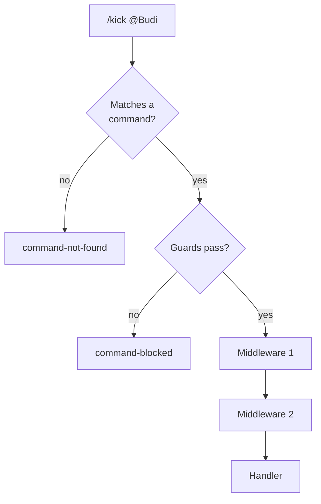

import { ProviderSupport } from "/snippets/provider-support.jsx"

Middleware is a function that runs before every command handler, so checks and logging you'd otherwise repeat in each command live in one place.

<ProviderSupport web={true} cloud={false} note="Middleware runs inside the command router, which only runs on a WhatsApp Web connection for now." />

## Add middleware

```ts bot.ts
import { Client } from 'zaileys'

const client = new Client({ commandPrefix: '/' })

client.use(async (ctx, next) => {
  console.log(`/${ctx.command} from ${ctx.senderId}`)
  await next()
})

client.command('ping', async (ctx) => {
  await ctx.reply('pong')
})
```

When someone sends `/ping`, your terminal prints `/ping from 6281234567890@s.whatsapp.net` and the bot replies `pong`.

A middleware receives two arguments:

- `ctx` — the same command context the handler gets: `ctx.command`, `ctx.args`, `ctx.senderId`, `ctx.reply()`, and the rest ([full list](/bots/commands#answer-from-a-command)).
- `next` — call and `await` it to continue to the next middleware and, at the end, the handler.

`client.use()` returns the client, so calls chain. You can add middleware at any time, and it applies from the next command on.

To define a middleware on its own, type it with `Middleware`:

```ts
import type { Middleware } from 'zaileys'

const logCommands: Middleware = async (ctx, next) => {
  console.log(`/${ctx.command} ${ctx.args.join(' ')}`)
  await next()
}

client.use(logCommands)
```

## How middleware runs



- Middleware runs in the order you added it.
- It only runs for a message that matches a command and passes that command's [guards](/bots/commands#limit-who-can-run-a-command). Plain messages, unknown commands, and blocked commands never reach it.
- Code after `await next()` runs once the handler — and any later middleware — has finished, so one middleware can wrap the whole command:

```ts
client.use(async (ctx, next) => {
  const started = Date.now()
  await next()
  console.log(`/${ctx.command} took ${Date.now() - started} ms`)
})
```

## Stop a command

Return without calling `next()`, and nothing after it runs — no later middleware, no handler:

```ts
const maintenance = process.env.MAINTENANCE === '1'

client.use(async (ctx, next) => {
  if (maintenance) {
    await ctx.reply('The bot is under maintenance. Try again in an hour.')
    return
  }
  await next()
})
```

Start the bot with `MAINTENANCE=1` and every command gets the maintenance message instead of running.

Call `next()` at most once per middleware. A second call throws `MIDDLEWARE_ERROR`, which reaches your `command-error` listener.

## Common patterns

### Allow only the bot owner

Keep a list of owner numbers and a list of commands only they may run:

```ts
const OWNERS = new Set(['6281234567890@s.whatsapp.net'])
const OWNER_ONLY = new Set(['broadcast', 'restart'])

client.use(async (ctx, next) => {
  if (OWNER_ONLY.has(ctx.command) && !OWNERS.has(ctx.senderId)) {
    await ctx.reply('Only the bot owner can use this command.')
    return
  }
  await next()
})
```

`ctx.command` is always the real command name, so typing an alias doesn't get around the check. For group admins, use the built-in [`admin` guard](/bots/commands#limit-who-can-run-a-command) instead. Not sure what `senderId` looks like? See [Addresses & JIDs](/concepts/jids).

### Limit how often each person runs commands

This allows each person five commands per minute, across all commands:

```ts
const WINDOW_MS = 60_000
const MAX_PER_WINDOW = 5
const recent = new Map<string, number[]>()

client.use(async (ctx, next) => {
  const now = Date.now()
  const times = (recent.get(ctx.senderId) ?? []).filter((t) => now - t < WINDOW_MS)
  if (times.length >= MAX_PER_WINDOW) {
    await ctx.reply('You are sending commands too fast. Wait a minute and try again.')
    return
  }
  times.push(now)
  recent.set(ctx.senderId, times)
  await next()
})
```

A sixth command within a minute gets the warning instead of running. To slow down a single command instead, use its [`cooldown` guard](/bots/commands#limit-who-can-run-a-command).

### Reply when a command fails

Add this middleware first, so it wraps everything after it:

```ts
client.use(async (ctx, next) => {
  try {
    await next()
  } catch (error) {
    await ctx.reply('Sorry, that command failed. The error has been logged.')
    throw error
  }
})
```

Throwing the error again keeps your `command-error` listener informed. If you swallow it, the command counts as successful. For most bots, one [`command-error` listener](/bots/commands#catch-a-command-that-throws) is simpler.

## Remove middleware

`client.unuse()` removes a middleware. Pass the same function you gave `client.use()`:

```ts
import type { Middleware } from 'zaileys'

const audit: Middleware = async (ctx, next) => {
  console.log(`audit: /${ctx.command} by ${ctx.senderId}`)
  await next()
}

client.use(audit)

client.unuse(audit)
```

An inline arrow function can't be removed later, so give it a name if you might need to. Middleware a [plugin](/bots/plugins) adds with `ctx.use()` is removed automatically when the plugin unloads.

## Common questions

<AccordionGroup>
  <Accordion title="Does middleware run for normal messages?">
    No, only for commands. To act on every message, listen with `client.on('message', …)` — see [Events](/concepts/events).
  </Accordion>
  <Accordion title="Can a middleware apply to only some commands?">
    Yes. Check `ctx.command` at the start and call `next()` right away for commands it shouldn't touch, as in [Allow only the bot owner](#allow-only-the-bot-owner).
  </Accordion>
  <Accordion title="Should I use a guard or a middleware?">
    Use guards (`group`, `private`, `admin`, `cooldown`) when a rule belongs to one command — they're declared on it and run first. Use middleware for rules that apply to every command, or anything guards can't express.
  </Accordion>
  <Accordion title="In what order does plugin middleware run?">
    Plugins load after the connection opens, so their middleware runs after everything you added with `client.use()` at startup. A plugin that reloads adds its middleware again at the end.
  </Accordion>
</AccordionGroup>

## When something fails

| Error code | What went wrong | How to fix it |
| --- | --- | --- |
| `MIDDLEWARE_ERROR` | A middleware threw, or called `next()` more than once. | Call `next()` exactly once to continue, or not at all to stop. The original error is on `error.cause`. |
| `HANDLER_ERROR` | The handler threw. The error passes back out through each middleware's `await next()`. | Catch it in a middleware or a `command-error` listener. |

Both arrive through the [`command-error` event](/bots/commands#catch-a-command-that-throws) as a `ZaileysCommandError`.

## Next steps

<CardGroup cols={2}>
  <Card title="Commands" icon="square-terminal" href="/bots/commands">
    Register commands, read arguments, and add guards.
  </Card>
  <Card title="Plugins" icon="plug" href="/bots/plugins">
    Ship middleware and commands together in one file.
  </Card>
</CardGroup>
