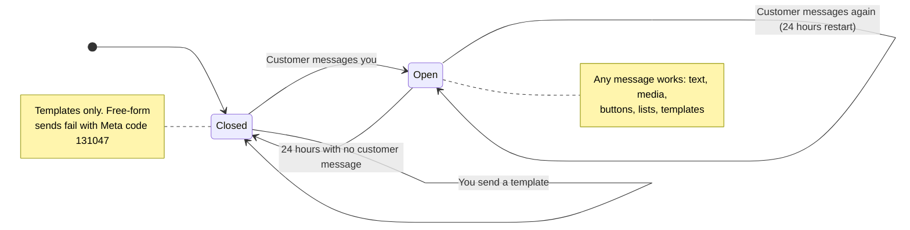

import { ProviderSupport } from "/snippets/provider-support.jsx"
import { Term } from "/snippets/glossary.jsx"

On the Cloud API you send with the same `client.send()` builder as on WhatsApp Web. This page covers only what changes: when Meta lets you send, and which calls are Cloud-only.

<ProviderSupport web={false} cloud={true} note="This page covers Cloud API specifics. The shared send guides apply to both providers." />

## Quick reference

| Task | Call | What happens |
| --- | --- | --- |
| Send text, media, buttons, a location, or a contact | `client.send(jid)` — see the [shared guides](#what-works-the-same) | Same code as WhatsApp Web |
| Message someone outside the 24-hour window | [`client.sendTemplate()`](#stay-inside-the-24-hour-window) | Delivers an approved template |
| Show blue ticks on a message | [`client.markRead(msg.chatId)`](#mark-a-message-as-read) | The sender sees their message as read |
| Show "typing…" | [`client.markRead(msg.chatId, { typing: true })`](#show-typing-while-you-reply) | Blue ticks plus a typing indicator |
| Download a photo or file someone sent | [`client.downloadMedia(msg.message().key)`](#download-media-people-send-you) | The file's bytes and type |
| Check what the Cloud API can send | [Capability table](#what-you-can-send) | Supported, limited, or rejected |

## What works the same

Zaileys turns your builder calls into Graph API requests, so these guides apply as written:

| To send | Read |
| --- | --- |
| Text, replies, and formatting | [Text & replies](/messaging/text) |
| Photos, videos, audio, documents, and stickers | [Send media](/messaging/media) |
| Reply buttons and lists | [Buttons & lists](/messaging/interactive) |
| Locations and contact cards | [Polls, locations & more](/messaging/polls-and-more) |
| Reactions | [Edit, delete & react](/messaging/edit-delete-react) |

A reply bot is identical on both providers:

```ts
client.on('text', async (msg) => {
  if (msg.text === 'hours') {
    await msg.reply('We are open 09:00–21:00, Monday to Saturday.')
  }
})
```

Media accepts a URL, a file path, or a `Buffer`. Zaileys uploads the file to Meta and sends it by its media ID, so you never handle media IDs yourself.

## Stay inside the 24-hour window

Meta only lets you send **free-form** messages — anything built with `client.send()` or `msg.reply()` — within 24 hours of the customer's last message to you. This is the <Term id="service-window" />. Outside it, you can only send an approved [template](/cloud/templates).



- **A customer's message opens the window.** Every new message from them restarts the 24 hours.
- **Your own messages don't extend it.** Only the customer's messages count.
- **A template doesn't open it either.** It gets a message to the customer; when they reply, the window opens.

In code:

```ts
const customer = '6281234567890'

// Always allowed: an approved template
await client.sendTemplate(customer, 'order_shipped', 'en_US', [
  { type: 'body', parameters: [{ type: 'text', text: 'Budi' }, { type: 'text', text: '#1042' }] },
])

// Allowed only if this customer messaged you in the last 24 hours
await client.send(customer).text('Your parcel is out for delivery.')
```

Outside the window, Meta refuses the free-form send with error code `131047`. Depending on the error, Meta reports it in one of two places:

- **The send rejects.** You get a `ZaileysBuilderError` with code `SEND_FAILED`. Its `error.cause` is a `ZaileysCloudError` whose message ends in `(code 131047)`.
- **The send resolves, and a `message-status` event with status `failed` arrives later.** Its `error.code` is `131047`. See [Cloud events](/cloud/events).

Handle both, and fall back to a template:

```ts
import { ZaileysBuilderError, ZaileysCloudError } from 'zaileys'

const graphCode = (error: unknown): number | null => {
  const cloud = error instanceof ZaileysBuilderError ? error.cause : error
  if (!(cloud instanceof ZaileysCloudError)) return null
  const match = /\(code (\d+)/.exec(cloud.message)
  return match ? Number(match[1]) : null
}

try {
  await client.send('6281234567890').text('Your parcel is out for delivery.')
} catch (error) {
  if (graphCode(error) !== 131047) throw error
  await client.sendTemplate('6281234567890', 'order_shipped', 'en_US', [
    { type: 'body', parameters: [{ type: 'text', text: 'Budi' }, { type: 'text', text: '#1042' }] },
  ])
}

client.on('message-status', (status) => {
  if (status.status === 'failed' && status.error?.code === 131047) {
    console.warn(`${status.recipientId} is outside the 24-hour window — send a template instead`)
  }
})
```

Zaileys doesn't track the window for you. If you need to know in advance, store when each customer last messaged you and compare it with the current time.

## Mark a message as read

`client.markRead()` sends a read receipt for one incoming message:

```ts
client.on('text', async (msg) => {
  await client.markRead(msg.chatId)
})
```

The sender sees blue ticks on their message. `msg.chatId` is the incoming message's ID — despite its name, not the chat — and that's what `markRead()` needs.

<ParamField body="messageId" type="string" required>
  The ID of the incoming message. Inside a handler, that's `msg.chatId`.
</ParamField>
<ParamField body="typing" type="boolean" default="false">
  Also show "typing…" in the chat. See the next section.
</ParamField>

On WhatsApp Web, the equivalent is `client.chat.markRead()`, which works per chat instead of per message — see [Chats](/chats/chats).

## Show typing while you reply

Pass `{ typing: true }` to send the read receipt and a typing indicator in one request:

```ts
client.on('text', async (msg) => {
  await client.markRead(msg.chatId, { typing: true })
  const answer = `Order #1042 is on its way. It should arrive tomorrow.`
  await msg.reply(answer)
})
```

The sender sees blue ticks, then "typing…" until your reply arrives. On the Cloud API a typing indicator always comes with a read receipt, and Meta clears it on its own — there's no call to clear or refresh it. The WhatsApp Web version is in [Presence](/chats/presence).

## Download media people send you

On the Cloud API, the file stays on Meta's servers until you ask for it. `msg.media.buffer()` doesn't work here — use `client.downloadMedia()` with the message's key:

```ts
import { writeFile } from 'node:fs/promises'

client.on('image', async (msg) => {
  const file = await client.downloadMedia(msg.message().key)
  if (!file) return
  await writeFile(`./inbox/${msg.chatId}.jpg`, file.buffer)
  await msg.reply(`Saved your photo (${file.size} bytes, ${file.mime}).`)
})
```

It resolves to `{ buffer, mime, size }`, or `null` when the message isn't in the message store or has no file. Zaileys fetches Meta's short-lived download link and the file in one call, so download soon after the webhook arrives. More options, and a helper that works on both providers, are in [Receiving media](/messaging/receiving-media).

## Send contact cards

`contact()` takes a vCard, the same as on WhatsApp Web. The Cloud API needs a first name as well as a display name, so Zaileys reads the `N:` line — or, without one, splits the `FN:` name at the first space:

```ts
const vcard = [
  'BEGIN:VCARD',
  'VERSION:3.0',
  'FN:Budi Santoso',
  'N:Santoso;Budi',
  'TEL;type=CELL;waid=6281234567890:+62 812-3456-7890',
  'END:VCARD',
].join('\n')

await client.send(jid).contact(vcard)
```

The recipient sees a card named **Budi Santoso** they can message or save. Only `FN`, `N`, and `TEL` lines are read; `ORG`, `EMAIL`, and other lines are dropped. A vCard with neither an `FN` nor a `TEL` line rejects with `SEND_FAILED`. The full rules are in [Polls, locations & more](/messaging/polls-and-more).

## What you can send

| Content | On the Cloud API | Notes |
| --- | --- | --- |
| Text, replies, formatting | ✓ Supported | `.mentions()` and `.disappearing()` are ignored. |
| Photo, video, document, sticker | ✓ Supported | Uploaded to Meta for you. |
| Audio | ◐ Limited | Always arrives as an audio message; `ptt` is ignored. |
| Round video note | ◐ Limited | Arrives as a regular video. |
| `viewOnce`, `gifPlayback` | ◐ Ignored | The file arrives as a normal photo or video. |
| Reaction | ✓ Supported | `client.react(key, '👍')` or `msg.react('👍')`. |
| Location | ✓ Supported | Including `name` and `address`. |
| Contact card | ✓ Supported | Converted from your vCard — see [above](#send-contact-cards). |
| Reply buttons | ◐ Limited | Up to 3, text header only. |
| List | ✓ Supported | |
| One link button | ◐ Limited | Only as the single button in the message. |
| Approved templates | ✓ Supported | `client.sendTemplate()` — see [Templates](/cloud/templates). |
| WhatsApp Flows, product messages, address requests | ✓ Cloud-only | `client.cloud` — see [Business & commerce](/cloud/business). |
| Album | ✗ Rejects | `SEND_FAILED`. Send each photo on its own. |
| Poll, group event, group invite, product card (`.product()`) | ✗ Rejects | `SEND_FAILED`, with `NOT_IMPLEMENTED` on `error.cause`. |
| Copy, call, and reminder buttons, carousels, media headers | ✗ Rejects | `SEND_FAILED`, with `NOT_IMPLEMENTED` on `error.cause`. |
| Rich responses (`{ rich: true }`) | ✗ Rejects | `SEND_FAILED`, with `NOT_IMPLEMENTED` on `error.cause`. |
| Statuses | ✗ Not available | The Cloud API has no statuses. |
| Edit, delete, pin, forward | ✗ Not available | `edit()`, `delete()`, and `pin()` throw `UNSUPPORTED_ON_CLOUD`; `forward()` throws `client not connected`. |

For every feature across both providers, see the [feature matrix](/feature-matrix).

## When something isn't supported

Zaileys fails straight away with a typed error, in one of two ways.

**Content the Cloud API can't carry** — a poll, a carousel, four reply buttons — rejects the send with a `ZaileysBuilderError` (code `SEND_FAILED`). The Cloud error is on `error.cause`, with code `NOT_IMPLEMENTED`:

```ts
import { ZaileysBuilderError, ZaileysCloudError } from 'zaileys'

try {
  await client.send(jid).poll('Pick a delivery day', ['Monday', 'Tuesday'])
} catch (error) {
  const notOnCloud =
    error instanceof ZaileysBuilderError &&
    error.cause instanceof ZaileysCloudError &&
    error.cause.code === 'NOT_IMPLEMENTED'
  if (!notOnCloud) throw error
  await client.send(jid).list({
    description: 'Pick a delivery day',
    buttonText: 'Choose a day',
    sections: [{ title: 'This week', rows: [{ id: 'day:mon', title: 'Monday' }, { id: 'day:tue', title: 'Tuesday' }] }],
  })
}
```

The message on `error.cause` says what's missing, for example `this content type is not supported on the cloud provider yet`.

**WhatsApp Web–only modules and methods** — `client.group`, `client.privacy`, `client.newsletter`, `client.community`, `client.profile`, `client.chat`, `client.contact`, `client.business`, `client.presence`, `edit()`, `delete()`, `pin()`, `unpin()`, `setDisappearing()`, and `rejectCall()` — throw a `ZaileysProviderError` with code `UNSUPPORTED_ON_CLOUD` as soon as you touch them:

```ts
import { ZaileysProviderError } from 'zaileys'

try {
  await client.chat.archive('6281234567890@s.whatsapp.net')
} catch (error) {
  if (error instanceof ZaileysProviderError) {
    console.warn(error.message)
  }
}
```

The message reads `chat is not supported by the official WhatsApp Cloud API — it only exists on the web (baileys) provider`, and `error.feature` is `'chat'`.

<Warning>
  Commands, middleware, plugins, `broadcast()`, and scheduled sends also need the WhatsApp Web connection. On the Cloud API, handle `text` events instead of commands, and send to each recipient in a loop — see [Send a campaign](/cloud/templates#send-a-campaign).
</Warning>

## Common questions

<AccordionGroup>
  <Accordion title="Why did my reply fail when the same code worked yesterday?">
    The customer's 24-hour window probably closed. Free-form sends only work within 24 hours of their last message. Send an approved [template](/cloud/templates) and wait for them to reply.
  </Accordion>
  <Accordion title="Can I message a number that never messaged my business?">
    Only with an approved template. Free-form messages need an open 24-hour window, and only the customer can open it.
  </Accordion>
  <Accordion title="Why doesn't client.chat.markRead() work on the Cloud API?">
    `client.chat` is a WhatsApp Web module, so it throws `UNSUPPORTED_ON_CLOUD`. On the Cloud API, call `client.markRead(msg.chatId)` for each message instead.
  </Accordion>
  <Accordion title="Why does downloadMedia() return null?">
    The message isn't in the message store — the default store is in memory, so a restart forgets it — or it has no file. Use a database-backed [store](/data/storage) if you download later.
  </Accordion>
  <Accordion title="Do I send to a phone number or a JID?">
    Either. `6281234567890` and `6281234567890@s.whatsapp.net` both work — Zaileys strips the `@…` part before calling the Graph API.
  </Accordion>
</AccordionGroup>

## When a send fails

| Error | What went wrong | How to fix it |
| --- | --- | --- |
| `SEND_FAILED` with a `NOT_IMPLEMENTED` cause | The Cloud API can't carry that content, such as a poll or a carousel. | Use a supported type from [What you can send](#what-you-can-send). |
| `SEND_FAILED` with a `REQUEST_FAILED` cause ending in `(code 131047)` | The customer's 24-hour window is closed. | Send an approved [template](/cloud/templates). |
| `SEND_FAILED` with another `REQUEST_FAILED` cause | Meta refused the message. Its reason and code are in `error.cause.message`. | Look the code up in [Cloud events](/cloud/events#fix-common-meta-errors). |
| `UNSUPPORTED_ON_CLOUD` | You used a WhatsApp Web–only module or method. | Check `client.provider` first, or use the [feature matrix](/feature-matrix). |
| `INVALID_OPTIONS` — `client not connected` | You sent before `connect` finished, or used `broadcast()`, `scheduleAt()`, or `forward()`. | Send from a handler or after the `connect` event. Loop over recipients instead of `broadcast()`. |
| `CONFIG` — `markRead(messageId) is only available on the cloud provider` | `markRead()` on WhatsApp Web, or before the client started connecting. | Use `client.chat.markRead()` on WhatsApp Web. |
| `AUTH` | Meta rejected your access token. | Generate a new token — see [Cloud API setup](/cloud/setup). |

More in [Error handling](/data/error-handling) and [Limits](/cloud/limits).

## Next steps

<CardGroup cols={2}>
  <Card title="Templates" icon="file-text" href="/cloud/templates">
    Reach customers outside the 24-hour window.
  </Card>
  <Card title="Cloud events" icon="zap" href="/cloud/events">
    Track delivery with `message-status`.
  </Card>
  <Card title="Business & commerce" icon="store" href="/cloud/business">
    Flows, product messages, and address requests.
  </Card>
  <Card title="Limits" icon="gauge" href="/cloud/limits">
    Meta's sending limits and how to stay within them.
  </Card>
</CardGroup>
