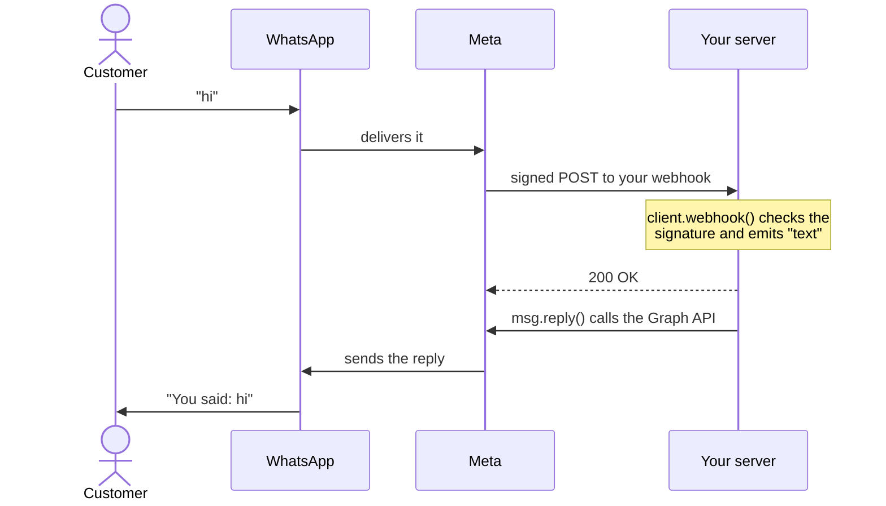

import { Term } from "/snippets/glossary.jsx"

The Official provider runs your bot on Meta's WhatsApp Cloud API, with the same handlers and send builder you use on WhatsApp Web.

## When to use it

Pick the Official provider (`provider: 'cloud'`) when you run a business channel:

- **Customer support on a business number**, without the ban risk of automating WhatsApp Web.
- **Messages people didn't ask for just now**, such as one-time passwords, order updates, and reminders, sent with approved [templates](/cloud/templates).
- **A server that answers HTTP requests**, including serverless routes, instead of a process that stays connected.

Need groups, channels, polls, or status? Those only exist on WhatsApp Web. [Choose a provider](/providers) compares the two side by side.

## How a message flows



1. Meta sends every incoming message to your <Term id="webhook" /> as an HTTPS `POST`, signed with your app secret.
2. `client.webhook()` checks the signature, answers `200`, and emits the same events as WhatsApp Web: `text`, `image`, `button-click`, and so on.
3. Every send, whether `msg.reply()` or `client.send()`, is an HTTPS request to Meta's Graph API at `https://graph.facebook.com/v23.0` by default.

Nothing stays connected, so there's no QR code, no saved <Term id="session" />, and no reconnecting.

## A minimal Cloud bot

```ts bot.ts
import { Client } from 'zaileys'

const client = new Client({
  provider: 'cloud',
  cloud: {
    accessToken: process.env.WA_TOKEN!,
    phoneNumberId: process.env.WA_PHONE_ID!,
    verifyToken: process.env.WA_VERIFY_TOKEN!,
    appSecret: process.env.WA_APP_SECRET!,
  },
})

client.on('text', async (msg) => {
  await msg.reply(`You said: ${msg.text}`)
})

client.on('message-status', (status) => {
  console.log(`${status.id} is ${status.status}`)
})

export const webhook = client.webhook()
```

- `provider: 'cloud'` and the four `cloud` values are the only Cloud-specific setup. [Meta app setup](/cloud/setup) shows where each value comes from.
- The `text` handler is identical to one on WhatsApp Web.
- `message-status` is Cloud-only. After a reply, it fires with `sent`, then `delivered`, then `read`, as the customer's phone reports each step.
- `webhook` has to be served on a public HTTPS URL. [Webhook](/cloud/webhook) shows Next.js, Hono, Express, and Node's `http` server.

## What stays the same

| You use | On the Cloud API | Guide |
| --- | --- | --- |
| `client.on('text' \| 'image' \| 'reaction' \| …)` | Same events and payloads, delivered through the webhook | [Events](/concepts/events) |
| `client.send(jid).text()`, `.image()`, `.location()`, `msg.reply()` | Same builder and the same result: the key of the sent message | [Text & replies](/messaging/text) |
| Buttons and lists | Same builder, within the Cloud API's limits | [Buttons & lists](/messaging/interactive) |
| Message stores | Memory, SQLite, PostgreSQL, Redis, and Convex all work | [Storage](/data/storage) |
| Typed errors | Same classes and `code` values, plus `ZaileysCloudError` | [Error handling](/data/error-handling) |

## What's different {#whats-different}

| | WhatsApp Web | Cloud API |
| --- | --- | --- |
| **Logging in** | QR code or pairing code, saved as a session | An access token. `connect()` only checks that it's valid. [Setup](/cloud/setup) |
| **Receiving messages** | Over a connection Zaileys keeps open | Meta calls your webhook, which needs a public HTTPS URL. [Webhook](/cloud/webhook) |
| **Messaging someone first** | Anyone with WhatsApp | Free-form messages only inside the <Term id="service-window" />. Outside it, an approved template. [Templates](/cloud/templates) |
| **What you can send** | Every message type | Text, media, locations, contacts, reactions, up to 3 reply buttons, and lists. Anything else rejects with `SEND_FAILED`, with `NOT_IMPLEMENTED` on `error.cause`. [Messaging](/cloud/messaging) |
| **Groups, channels, chats, profile, presence** | Available | `client.group`, `client.chat`, and the other WhatsApp Web modules throw `UNSUPPORTED_ON_CLOUD` |
| **Delivery and read receipts** | Not available | The `message-status` event. [Cloud events](/cloud/events) |
| **Sending limits** | WhatsApp's anti-spam rules | Meta's messaging limits and your number's quality rating. [Limits](/cloud/limits) |

The [feature matrix](/feature-matrix) answers "does X work on the Cloud API?" for every feature.

## What doesn't run on the Cloud API {#what-doesnt-run-on-the-cloud-api}

In the current release, these features depend on the WhatsApp Web connection. On the Cloud API they either never run or throw:

| Feature | What happens on the Cloud API | Do this instead |
| --- | --- | --- |
| Commands (`client.command()`) | Never dispatched, so command handlers don't run | Match the command in a `text` handler (example below) |
| Middleware | Never runs, since it runs with commands | Put shared checks at the top of your `text` handler |
| Plugins | Never loaded | Register the handlers directly in your code |
| `client.broadcast()` | Throws `INVALID_OPTIONS` with `client not connected` | Loop over the recipients with `client.send()` (example below), or `client.sendTemplate()` for people outside the 24-hour window |
| `client.scheduleAt()` | The message is saved, but the send fails when it's due | Call `client.send()` from your own scheduler, such as a cron job or a queue |
| Auto-delete | Never starts | Old messages stay in the message store until you remove them |
| `client.forward()` | Throws `INVALID_OPTIONS` with `client not connected` | Send the content again with `client.send()` |

Answer commands from a `text` handler:

```ts
client.on('text', async (msg) => {
  const [command, ...args] = (msg.text ?? '').trim().split(/\s+/)

  if (command === '/price') {
    await msg.reply(`${args.join(' ') || 'Coffee'}: Rp 25.000`)
  } else if (command === '/help') {
    await msg.reply('Commands: /price <item>, /help')
  }
})
```

Send an announcement to a list, one message per second:

```ts
const customers = ['6281234567890@s.whatsapp.net', '6289876543210@s.whatsapp.net']

for (const customer of customers) {
  await client.send(customer).text('Our store opens at 9 AM tomorrow.')
  await new Promise((resolve) => setTimeout(resolve, 1000))
}
```

Free-form sends like this only reach people who messaged you in the last 24 hours. For everyone else, send a template.

## What the Cloud API adds

| To | Call | Guide |
| --- | --- | --- |
| Receive messages and status updates | `client.webhook()` | [Webhook](/cloud/webhook) |
| Send an approved template | `client.sendTemplate(to, name, languageCode, components?)` | [Templates](/cloud/templates) |
| List, create, and delete templates | `client.cloud.templates` | [Templates](/cloud/templates) |
| Mark a message read and show a typing indicator | `client.markRead(messageId, { typing: true })` | [Messaging](/cloud/messaging) |
| Track sent, delivered, read, and failed | `client.on('message-status', …)` | [Cloud events](/cloud/events) |
| Hear when Meta approves or rejects a template | `client.on('template-status', …)` | [Cloud events](/cloud/events) |
| Send a WhatsApp Flow and read the answers | `client.cloud.flows.send()` and the `flow-response` event | [Business tools](/cloud/business) |
| Send products and receive orders | `client.cloud.commerce` and the `order` event | [Business tools](/cloud/business) |
| Ask for a shipping address | `client.cloud.sendAddressRequest()` | [Business tools](/cloud/business) |
| Read or update the business profile | `client.cloud.profile` | [Business tools](/cloud/business) |
| Block and unblock users | `client.cloud.blocklist` | [Business tools](/cloud/business) |
| Create click-to-chat QR codes | `client.cloud.qr` | [Business tools](/cloud/business) |
| Read conversation and message analytics | `client.cloud.analytics` | [Business tools](/cloud/business) |
| Check the number's quality rating or register it | `client.cloud.info()` and `client.cloud.phone` | [Business tools](/cloud/business) |

On WhatsApp Web, these calls throw a `ZaileysCloudError` with code `CONFIG`, for example `webhook() is only available on the cloud provider`. Template management, the flows list, catalogs, and analytics also need `wabaId` — see [Which calls need wabaId](/cloud/setup#which-calls-need-wabaid).

## Common questions

<AccordionGroup>
  <Accordion title="Do I need my own server?">
    You need something that answers HTTPS requests at a public URL, because that's how Meta delivers messages. A long-running Node.js server, a container, or a serverless route such as a Next.js route handler all work. For local development, a tunnel gives your machine a public URL — see [Webhook](/cloud/webhook#develop-locally-with-a-tunnel).
  </Accordion>
  <Accordion title="Can I message a customer who hasn't written to me?">
    Only with an approved template. Free-form messages work inside the 24-hour window that opens each time the customer messages you. After that, a free-form send fails with Meta error `131047`. See [Templates](/cloud/templates).
  </Accordion>
  <Accordion title="Can I keep my commands and plugins?">
    Not in the current release: commands, middleware, and plugins are only wired up over the WhatsApp Web connection. Move the logic into `client.on('text', …)` — the example under [What doesn't run on the Cloud API](#what-doesnt-run-on-the-cloud-api) shows the pattern.
  </Accordion>
  <Accordion title="sendTemplate() says it's only available on the cloud provider, but I set provider: 'cloud'">
    The Cloud transport starts the first time the client connects or receives a webhook. With `autoConnect: false`, run `await client.connect()` before calling `sendTemplate()` or `markRead()`.
  </Accordion>
  <Accordion title="Does the Cloud API cost money?">
    Meta charges for some conversations under its [WhatsApp Business pricing](https://developers.facebook.com/docs/whatsapp/pricing). Zaileys itself is free and adds nothing on top.
  </Accordion>
  <Accordion title="Can one app use the Cloud API and WhatsApp Web?">
    Yes. Create one client with `provider: 'cloud'` and one without. Each has its own handlers and number. See [Choose a provider](/providers).
  </Accordion>
</AccordionGroup>

## Next steps

<CardGroup cols={2}>
  <Card title="Meta app setup" icon="key-round" href="/cloud/setup">
    Get the access token, phone number ID, and webhook secrets.
  </Card>
  <Card title="Webhook" icon="webhook" href="/cloud/webhook">
    Mount the webhook on Next.js, Hono, Express, or Node.
  </Card>
  <Card title="Templates" icon="file-text" href="/cloud/templates">
    Message people outside the 24-hour window.
  </Card>
  <Card title="Limits" icon="gauge" href="/cloud/limits">
    Meta's restrictions, and how to work within them.
  </Card>
</CardGroup>
