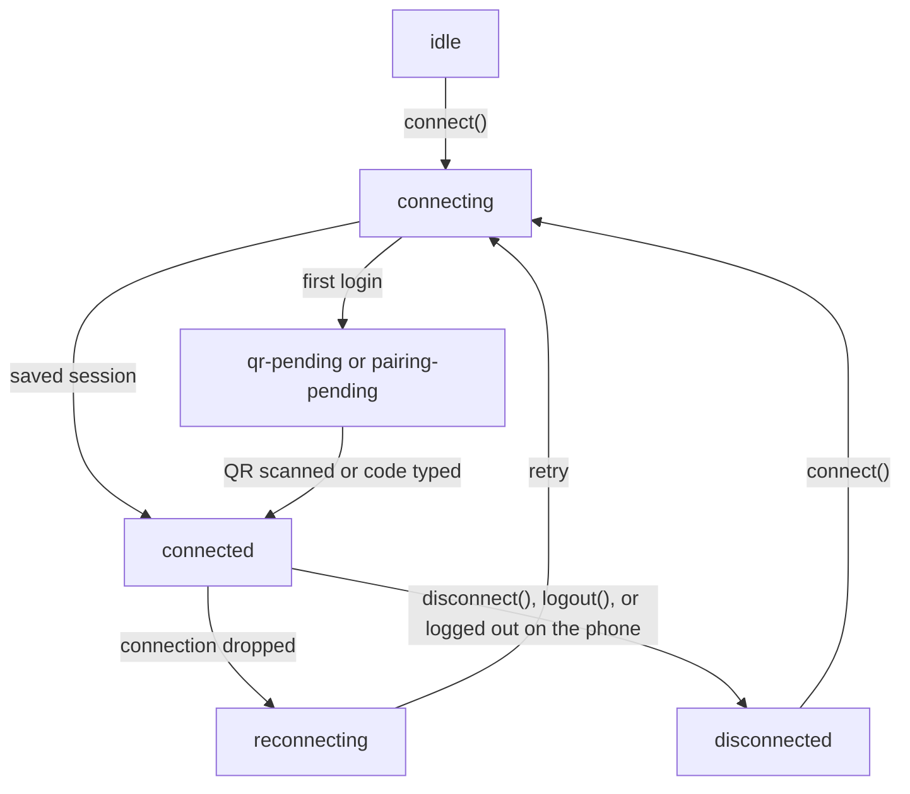

import { Term } from "/snippets/glossary.jsx"

The `Client` is the one object your bot is built around: it holds the connection to WhatsApp, fires an event for everything that happens, and sends your messages.

```ts bot.ts
import { Client } from 'zaileys'

const client = new Client()

client.on('connect', ({ me }) => {
  console.log(`Ready as ${me.id}`)
})
```

One client is one WhatsApp account. To run several numbers from one process, create one client per number, each with its own `sessionId` — see [Multiple accounts](/data/multi-account).

## The connection lifecycle

A client moves through a fixed set of states. `client.state` always tells you which one it's in:



The diagram shows the main path. The table below lists all eight states, including the brief `disconnecting` step.

| State | What's happening | Events you get |
| --- | --- | --- |
| `idle` | The client exists but hasn't started connecting. | — |
| `connecting` | Opening the connection and loading the saved <Term id="session" />. | — |
| `qr-pending` | Waiting for you to scan the QR code. | `qr`, once per fresh code |
| `pairing-pending` | Waiting for you to type the pairing code. | `pairing-code` |
| `connected` | Logged in. Messages start arriving. | `connect`, then message events |
| `reconnecting` | The connection dropped. The client waits, then tries again. | `reconnecting`, then `disconnect` with `willReconnect: true` |
| `disconnecting` | Shutting down after `disconnect()` or `logout()`. | — |
| `disconnected` | Stopped. No retry is scheduled. | `disconnect` with `willReconnect: false` |

This bot logs each stage as it happens:

```ts bot.ts
import { Client } from 'zaileys'

const client = new Client()

client.on('qr', () => console.log('Waiting for a scan, state:', client.state))
client.on('connect', ({ me }) => console.log(`Connected as ${me.id}, state:`, client.state))
client.on('reconnecting', ({ attempt, delayMs, reason }) => {
  console.log(`Connection lost (${reason}). Retry #${attempt} in ${delayMs} ms`)
})
client.on('disconnect', ({ reason, willReconnect }) => {
  if (!willReconnect) console.log(`Stopped for good: ${reason}`)
})
```

Message events only start after `connect`: the client begins listening for messages when the connection opens.

## Start the client

### Automatically

`new Client()` starts connecting by itself, because `autoConnect` defaults to `true`. The connection starts on a later tick, so every handler you register right after `new Client()` is in place before the first event fires.

If that automatic start fails — for example, a Cloud API token Meta rejects — the failure goes to the `error` event, and only if something listens for it. Otherwise nothing is printed, so add a handler:

```ts
client.on('error', ({ error }) => {
  console.error('Could not connect:', error.message)
})
```

### When you're ready

Set `autoConnect: false` to finish your own setup first — read a config file, open a database — and connect when you choose. `connect()` resolves once the client is connected:

```ts bot.ts
import { Client } from 'zaileys'

const client = new Client({ autoConnect: false })

client.on('text', async (msg) => {
  await msg.reply('pong')
})

await client.connect()
console.log(client.state) // 'connected'
```

- On a first login, `connect()` resolves only after you scan the QR code or enter the pairing code, so `await` waits that long.
- It rejects when the connection closes and won't be retried, for example with `connection closed (logged-out)`.
- With `authType: 'pairing'` and no `phoneNumber`, it rejects right away with `phoneNumber is required when authType is "pairing"`.
- Calling it while the client is already starting up or connected does nothing and resolves immediately.

## Stay connected

When the connection drops for a reason that can recover — the network went away, WhatsApp asked for a restart — the client reconnects on its own. Each retry waits twice as long as the last: about 3 s, 6 s, 12 s, 24 s, 48 s, then 60 s for every retry after that. Every wait varies by up to 20% so many bots don't retry at the same moment. The terminal shows each attempt:

```text
[zaileys] Connection lost (connection-lost). Reconnecting in 3.2s (attempt 1)...
```

A successful reconnect resets the count. If WhatsApp rate-limits the account (`rate-limited`), the client waits 5 minutes before the next try instead. Change any of these numbers with the `reconnect` option — see [Tune reconnects](/concepts/configuration#tune-reconnects).

If the saved session loads but the connection keeps closing before login, the second attempt adds a hint:

```text
[zaileys] Connection lost (connection-closed). Reconnecting in 6.1s (attempt 2)...
[zaileys] The saved session looks invalid or corrupted (connection keeps closing before it authenticates). Delete the auth folder (default: ./.zaileys) and run again to scan a fresh QR / request a new pairing code.
```

### Disconnects that need a new login

A few reasons mean the saved login no longer works. The client deletes it, so the next start shows a QR code or pairing code again:

| Reason | What happened | Retried? |
| --- | --- | --- |
| `logged-out` | The device was removed in **WhatsApp → Linked devices**, or you called `logout()`. | No |
| `connection-replaced` | Another connection using the same session took over. | No |
| `forbidden` | WhatsApp refused the account. | No |
| `bad-session` | The saved session is corrupted. | Yes, with a fresh login |

WhatsApp sometimes reports `logged-out` by mistake right after a successful connection, so the client retries that case up to two times, 3 seconds apart, before it deletes anything. Every other reason is retried. The [events reference](/reference/events) lists them all.

### Endless login loops are stopped

If a login never completes, the client stops after 5 QR codes or 3 pairing codes and fires `auth-exhausted`, instead of asking WhatsApp for new codes forever — a pattern that can get a number restricted. Fix the cause (a wrong phone number, nobody scanning), then call `client.connect()` to start over. The limits are the `authGuard` option in [Configuration](/concepts/configuration#stop-a-stuck-login-loop).

## Stop the client

| To | Call | Saved login |
| --- | --- | --- |
| Stop the bot and keep the login | `await client.disconnect()` | Kept — the next start connects without a QR code |
| Unlink the device and forget the login | `await client.logout()` | Deleted — the next start needs a new QR or pairing code |

`disconnect()` cancels any pending reconnect, stops message handling, commands, scheduled messages, auto-delete, and plugins, then closes the connection, the auth store, and the message store. It fires `disconnect` with `willReconnect: false`.

`logout()` also logs out on WhatsApp's side — the bot disappears from the phone's **Linked devices** list — and deletes the saved login before disconnecting. Its `disconnect` event has the reason `logged-out`.

Stop cleanly when you press Ctrl+C:

```ts bot.ts
import { Client } from 'zaileys'

const client = new Client()

process.on('SIGINT', async () => {
  await client.disconnect()
  process.exit(0)
})
```

## Check the connection

Read `client.state` whenever you need to know where the client is, for example before a scheduled job runs:

```ts
if (client.state === 'connected') {
  await client.send(jid).text('Daily report: 12 new orders')
}
```

Calls made before the client has started, or after it stopped, throw `ZaileysBuilderError` with code `INVALID_OPTIONS` and the message `client not connected`. Wait for the `connect` event before you send.

A few other read-only properties are handy: `client.sessionId`, `client.provider` (`'baileys'` or `'cloud'`), `client.store`, and `client.auth`. The [Client reference](/reference/client) lists every method and property.

## On the Cloud API

With `provider: 'cloud'` there's no phone to link and no connection to keep open, so the lifecycle is much shorter:

- **`connect()` only checks your token.** It asks Meta's Graph API for your <Term id="phone-number-id" />. If Meta answers, the state becomes `connected` and `connect` fires with `me.id` set to that ID.
- **A rejected token** makes `connect()` reject with `ZaileysCloudError` code `AUTH` and the message `cloud auth rejected (401) — check accessToken/phoneNumberId`. A network failure rejects with code `REQUEST_FAILED`.
- **There's no QR code, pairing code, session folder, or reconnecting.** The states go `idle → connecting → connected`, or to `disconnected` if the check fails. The `qr`, `pairing-code`, `reconnecting`, and `auth-exhausted` events never fire.
- **Messages arrive through the <Term id="webhook" />**, not the connection. `client.webhook()` returns the handler Meta calls ([Webhook](/cloud/webhook)). Replies and sends still need the `connected` state — until the token check passes, they throw `client not connected`.
- **`disconnect()`** stops the client and fires `disconnect` with the reason `unknown`. There's no linked device, so use `disconnect()` rather than `logout()`.
- **Some features need the WhatsApp Web connection and don't run here:** commands and middleware, plugins, auto-delete, `broadcast()`, scheduled sends, and `forward()`. `broadcast()` and `forward()` throw `client not connected`, and scheduled messages never go out. Events you register with `client.on()` work normally.

Check the token yourself at startup:

```ts bot.ts
import { Client, ZaileysCloudError } from 'zaileys'

const client = new Client({
  provider: 'cloud',
  autoConnect: false,
  cloud: {
    accessToken: process.env.WA_TOKEN!,
    phoneNumberId: process.env.WA_PHONE_ID!,
  },
})

try {
  await client.connect()
  console.log('Token accepted, state:', client.state) // 'connected'
} catch (error) {
  if (error instanceof ZaileysCloudError && error.code === 'AUTH') {
    console.error('Meta rejected the token. Generate a new one in the Meta dashboard.')
  }
}
```

## Common questions

<AccordionGroup>
  <Accordion title="Do I need to call connect()?">
    No. `new Client()` connects by itself. Call `connect()` only when you set `autoConnect: false`, or to start again after `disconnect()` or `auth-exhausted`.
  </Accordion>
  <Accordion title="How do I know when the bot is ready to send?">
    Listen for `connect`, or set `autoConnect: false` and `await client.connect()`. Both mean the client is in the `connected` state.
  </Accordion>
  <Accordion title="Where is the login saved, and how do I start over?">
    On WhatsApp Web, the session lives in `./.zaileys/auth/<sessionId>` — `./.zaileys/auth/default` unless you set `sessionId`. Stop the bot, delete that folder, and start again to get a new QR code. To keep sessions in a database instead, see [Keep sessions in a database](/concepts/configuration#keep-sessions-in-a-database).
  </Accordion>
  <Accordion title="The terminal keeps printing “Connection lost … Reconnecting”">
    If the bot connected before, it's usually a network problem and the client recovers by itself. If it never gets to `Connected as …`, the saved session is broken: delete the session folder and log in again.
  </Accordion>
  <Accordion title="Why did my bot stop after a few QR codes?">
    Nobody scanned in time, so the login guard stopped the client after 5 codes and fired `auth-exhausted`. Restart the bot, or call `client.connect()`, and scan the newest code.
  </Accordion>
</AccordionGroup>

## Next steps

<CardGroup cols={2}>
  <Card title="Configuration" icon="sliders-horizontal" href="/concepts/configuration">
    Sessions, login methods, reconnects, and logs.
  </Card>
  <Card title="Events" icon="zap" href="/concepts/events">
    Every event the client fires, and how handlers run.
  </Card>
  <Card title="Client reference" icon="square-code" href="/reference/client">
    Every method and property, with types.
  </Card>
  <Card title="Multiple accounts" icon="users" href="/data/multi-account">
    Run several WhatsApp numbers from one process.
  </Card>
</CardGroup>
