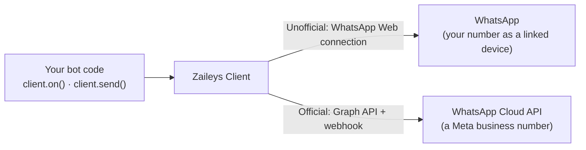

Zaileys takes care of the hard parts of WhatsApp — logging in, staying connected, decoding messages, and uploading media — so your code only describes what the bot should do.

## What you can build

| Example | What you'd use | Works on |
| --- | --- | --- |
| A support bot that answers common questions | [Events](/concepts/events) | Both |
| A bot that answers `/price`, `/help`, and other commands | [Commands](/bots/commands) | WhatsApp Web |
| An order bot customers tap through | [Buttons & lists](/messaging/interactive) | Both |
| Daily reminders or announcements to a list | [Broadcast & schedule](/bots/broadcast-and-schedule) | WhatsApp Web |
| A group assistant that welcomes new members | [Groups](/groups/groups) | WhatsApp Web |
| One-time passwords and delivery alerts | [Templates](/cloud/templates) | Cloud API |

## How it works



- **You write handlers** — "when a text arrives, reply" — with `client.on()`, and send with `client.send()`.
- **Zaileys talks to WhatsApp** through the provider you choose. You switch providers with one option; your handlers stay the same.
- **Everything is typed.** Your editor autocompletes every event name, payload field, and send option.

## Hello world

This bot replies to every text message. Pick a provider — the choice follows you through the docs.

<Tabs>
  <Tab title="Unofficial">

    ```ts bot.ts
    import { Client } from 'zaileys'

    const client = new Client()

    client.on('text', async (msg) => {
      await msg.reply(`You said: ${msg.text}`)
    })
    ```

    Run `npx tsx bot.ts`. Your terminal shows:

    ```text
    [zaileys] Connecting to WhatsApp (session: default)...
    [zaileys] Scan the QR code above with WhatsApp > Linked devices to authenticate.
    ```

    Scan the QR code from **WhatsApp → Settings → Linked devices → Link a device**. Once `Connected as …` appears, message the bot from another account: send `hi` and it answers `You said: hi`.

  </Tab>
  <Tab title="Official">

    ```ts app/api/whatsapp/route.ts
    import { Client } from 'zaileys'

    const client = new Client({
      provider: 'cloud',
      cloud: {
        accessToken: process.env.WA_TOKEN!,
        phoneNumberId: process.env.WA_PHONE_ID!,
        verifyToken: process.env.WA_VERIFY_TOKEN!,
        appSecret: process.env.WA_APP_SECRET!,
      },
    })

    client.on('text', async (msg) => {
      await msg.reply(`You said: ${msg.text}`)
    })

    const webhook = client.webhook()
    export const GET = webhook
    export const POST = webhook
    ```

    This is a Next.js route. Meta sends every incoming message to it, so register its public URL as your webhook in the Meta dashboard ([how](/cloud/webhook)). Then message your business number: send `hi` and it answers `You said: hi`.

  </Tab>
</Tabs>

<Tip>
  New to Zaileys? The [Quickstart](/quickstart) walks through this bot step by step, including setup and what to do when something goes wrong.
</Tip>

## Which provider should I use?

| If you want to… | Use |
| --- | --- |
| Automate your own number or a community, with no approval | **Unofficial** (WhatsApp Web) |
| Use groups, channels, polls, or status | **Unofficial** — the Cloud API doesn't have them |
| Run a customer-facing business channel with no ban risk | **Official** (Cloud API) |
| Message people who never messaged you first, like OTPs | **Official**, with Meta-approved templates |

Still unsure? The [provider comparison](/providers) covers cost, setup, and limits, and the [feature matrix](/feature-matrix) answers "does feature X work on provider Y?".

## Install

<CodeGroup>

```bash npm
npm install zaileys
```

```bash pnpm
pnpm add zaileys
```

```bash yarn
yarn add zaileys
```

```bash bun
bun add zaileys
```

</CodeGroup>

You need Node.js 20 or newer. Bun, Deno, and Termux work too ([details](/data/runtimes)). Database adapters and the `sharp` image accelerator are optional extras — [Installation](/installation) explains when you'd want them.

## Where to go next

<CardGroup cols={2}>
  <Card title="Quickstart" icon="rocket" href="/quickstart">
    A working bot in about five minutes, step by step.
  </Card>
  <Card title="Recipes" icon="chef-hat" href="/recipes/auto-reply">
    Complete bots to copy: commands, buttons, AI replies, broadcasts.
  </Card>
  <Card title="Send media" icon="image" href="/messaging/media">
    Photos, voice notes, documents, stickers, and albums.
  </Card>
  <Card title="API reference" icon="square-code" href="/reference/client">
    Every method, option, and event, with types and defaults.
  </Card>
</CardGroup>

## Get help

<CardGroup cols={2}>
  <Card title="Ask on Discord" href="https://discord.gg/HUcQe4xGr3">
    Stuck? Ask the community, share what you built, and get release news.
  </Card>
  <Card title="Report an issue" href="https://github.com/zeative/zaileys/issues">
    Found a bug or something unclear in the docs? Open an issue on GitHub.
  </Card>
</CardGroup>
