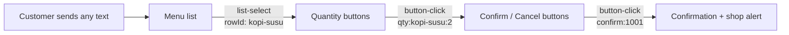

import { ProviderSupport } from "/snippets/provider-support.jsx"
import { StackBlitz } from "/snippets/stackblitz.jsx"
import { Term } from "/snippets/glossary.jsx"

This recipe builds a bot that takes a restaurant order entirely by taps — customers pick a dish from a menu, choose a quantity, and confirm, without typing anything after "hi".

<ProviderSupport web={true} cloud={true} note="It only uses a list and up to 3 reply buttons, which both providers support." />

## What you'll build

```text
Budi: hi
Bot:  Warung Sari
      What would you like to order today?
      [See menu]
Budi: (opens the menu and picks Kopi Susu)
Bot:  How many Kopi Susu? Rp15.000 each.
      [1] [2] [3]
Budi: (taps 2)
Bot:  Order #1001
      2 × Kopi Susu, total Rp30.000
      [Confirm] [Cancel]
Budi: (taps Confirm)
Bot:  Order #1001 confirmed. We'll message you when it's ready.
```

At the same moment, the shop's own number gets:

```text
New order #1001 from Budi: 2 × Kopi Susu, Rp30.000
```

## What you need

<Tabs>
  <Tab title="Unofficial">

    - Node.js 20 or newer, with `zaileys` installed: `npm install zaileys`.
    - A WhatsApp account for the bot, and a second account to order from.
    - Optional: a number that should receive order alerts, such as the shop owner's.

  </Tab>
  <Tab title="Official">

    - Node.js 20 or newer, with Zaileys and a small web server installed: `npm install zaileys hono @hono/node-server`.
    - A Meta app with the WhatsApp product, and four values from it: access token, <Term id="phone-number-id" />, verify token, and app secret. [Get them](/cloud/setup)
    - A public HTTPS URL that reaches your machine, for the <Term id="webhook" />.
    - Optional: a number that should receive order alerts.

  </Tab>
</Tabs>

## The complete bot

Save this as `bot.ts`:

<Tabs>
  <Tab title="Unofficial">

    ```ts bot.ts
    import { Client } from 'zaileys'

    type Item = { id: string; name: string; price: number }
    type Order = { id: number; chat: string; customer: string; item: Item; qty: number }

    const SHOP = 'Warung Sari'
    const OWNER = process.env.OWNER_JID

    const FOOD: Item[] = [
      { id: 'nasi-goreng', name: 'Nasi Goreng', price: 25000 },
      { id: 'mie-ayam', name: 'Mie Ayam', price: 20000 },
      { id: 'sate-ayam', name: 'Sate Ayam', price: 30000 },
    ]
    const DRINKS: Item[] = [
      { id: 'es-teh', name: 'Es Teh', price: 5000 },
      { id: 'kopi-susu', name: 'Kopi Susu', price: 15000 },
    ]
    const ITEMS = new Map([...FOOD, ...DRINKS].map((item) => [item.id, item]))

    const rupiah = (amount: number): string => `Rp${amount.toLocaleString('id-ID')}`
    const toRows = (items: Item[]) =>
      items.map((item) => ({ id: item.id, title: item.name, description: rupiah(item.price) }))

    const pending = new Map<number, Order>()
    let nextOrderId = 1001

    const client = new Client()

    client.on('text', async (msg) => {
      if (msg.isGroup || msg.isStory || msg.isNewsletter || msg.isOld) return

      await client.send(msg.roomId ?? msg.senderId).list({
        title: SHOP,
        description: 'What would you like to order today?',
        buttonText: 'See menu',
        footerText: 'Open 10:00–22:00',
        sections: [
          { title: 'Food', rows: toRows(FOOD) },
          { title: 'Drinks', rows: toRows(DRINKS) },
        ],
      })
    })

    client.on('list-select', async (pick) => {
      const item = ITEMS.get(pick.rowId)
      if (!item) return

      await client.send(pick.key.remoteJid ?? pick.sender.jid).buttons(
        [1, 2, 3].map((qty) => ({ id: `qty:${item.id}:${qty}`, text: String(qty) })),
        { text: `How many ${item.name}? ${rupiah(item.price)} each.` },
      )
    })

    client.on('button-click', async (tap) => {
      const chat = tap.key.remoteJid ?? tap.sender.jid
      const [action, first, second] = tap.buttonId.split(':')

      if (action === 'qty') {
        const item = ITEMS.get(first ?? '')
        const qty = Number(second)
        if (!item || !qty) return

        const order: Order = { id: nextOrderId++, chat, customer: tap.sender.pushName ?? tap.sender.jid, item, qty }
        pending.set(order.id, order)
        await client.send(chat).buttons(
          [
            { id: `confirm:${order.id}`, text: 'Confirm' },
            { id: `cancel:${order.id}`, text: 'Cancel' },
          ],
          { title: `Order #${order.id}`, text: `${qty} × ${item.name}, total ${rupiah(qty * item.price)}`, footer: SHOP },
        )
        return
      }

      if (action !== 'confirm' && action !== 'cancel') return
      const order = pending.get(Number(first))
      if (!order) {
        await client.send(chat).text('That order is no longer open. Send any message to start a new one.')
        return
      }
      pending.delete(order.id)

      if (action === 'cancel') {
        await client.send(chat).text(`Order #${order.id} cancelled.`)
        return
      }

      await client.send(chat).text(`Order #${order.id} confirmed. We'll message you when it's ready.`)
      if (OWNER) {
        const total = rupiah(order.qty * order.item.price)
        await client.send(OWNER).text(`New order #${order.id} from ${order.customer}: ${order.qty} × ${order.item.name}, ${total}`)
      }
    })
    ```

    Or run it in your browser, and scan the QR code that appears in its terminal:

    <StackBlitz code={"import { Client } from 'zaileys'\n\ntype Item = { id: string; name: string; price: number }\ntype Order = { id: number; chat: string; customer: string; item: Item; qty: number }\n\nconst SHOP = 'Warung Sari'\nconst OWNER = process.env.OWNER_JID\n\nconst FOOD: Item[] = [\n  { id: 'nasi-goreng', name: 'Nasi Goreng', price: 25000 },\n  { id: 'mie-ayam', name: 'Mie Ayam', price: 20000 },\n  { id: 'sate-ayam', name: 'Sate Ayam', price: 30000 },\n]\nconst DRINKS: Item[] = [\n  { id: 'es-teh', name: 'Es Teh', price: 5000 },\n  { id: 'kopi-susu', name: 'Kopi Susu', price: 15000 },\n]\nconst ITEMS = new Map([...FOOD, ...DRINKS].map((item) => [item.id, item]))\n\nconst rupiah = (amount: number): string => `Rp${amount.toLocaleString('id-ID')}`\nconst toRows = (items: Item[]) =>\n  items.map((item) => ({ id: item.id, title: item.name, description: rupiah(item.price) }))\n\nconst pending = new Map<number, Order>()\nlet nextOrderId = 1001\n\nconst client = new Client()\n\nclient.on('text', async (msg) => {\n  if (msg.isGroup || msg.isStory || msg.isNewsletter || msg.isOld) return\n\n  await client.send(msg.roomId ?? msg.senderId).list({\n    title: SHOP,\n    description: 'What would you like to order today?',\n    buttonText: 'See menu',\n    footerText: 'Open 10:00–22:00',\n    sections: [\n      { title: 'Food', rows: toRows(FOOD) },\n      { title: 'Drinks', rows: toRows(DRINKS) },\n    ],\n  })\n})\n\nclient.on('list-select', async (pick) => {\n  const item = ITEMS.get(pick.rowId)\n  if (!item) return\n\n  await client.send(pick.key.remoteJid ?? pick.sender.jid).buttons(\n    [1, 2, 3].map((qty) => ({ id: `qty:${item.id}:${qty}`, text: String(qty) })),\n    { text: `How many ${item.name}? ${rupiah(item.price)} each.` },\n  )\n})\n\nclient.on('button-click', async (tap) => {\n  const chat = tap.key.remoteJid ?? tap.sender.jid\n  const [action, first, second] = tap.buttonId.split(':')\n\n  if (action === 'qty') {\n    const item = ITEMS.get(first ?? '')\n    const qty = Number(second)\n    if (!item || !qty) return\n\n    const order: Order = { id: nextOrderId++, chat, customer: tap.sender.pushName ?? tap.sender.jid, item, qty }\n    pending.set(order.id, order)\n    await client.send(chat).buttons(\n      [\n        { id: `confirm:${order.id}`, text: 'Confirm' },\n        { id: `cancel:${order.id}`, text: 'Cancel' },\n      ],\n      { title: `Order #${order.id}`, text: `${qty} × ${item.name}, total ${rupiah(qty * item.price)}`, footer: SHOP },\n    )\n    return\n  }\n\n  if (action !== 'confirm' && action !== 'cancel') return\n  const order = pending.get(Number(first))\n  if (!order) {\n    await client.send(chat).text('That order is no longer open. Send any message to start a new one.')\n    return\n  }\n  pending.delete(order.id)\n\n  if (action === 'cancel') {\n    await client.send(chat).text(`Order #${order.id} cancelled.`)\n    return\n  }\n\n  await client.send(chat).text(`Order #${order.id} confirmed. We'll message you when it's ready.`)\n  if (OWNER) {\n    const total = rupiah(order.qty * order.item.price)\n    await client.send(OWNER).text(`New order #${order.id} from ${order.customer}: ${order.qty} × ${order.item.name}, ${total}`)\n  }\n})\n"} title="Zaileys order bot" />

  </Tab>
  <Tab title="Official">

    ```ts bot.ts
    import { serve } from '@hono/node-server'
    import { Hono } from 'hono'
    import { Client } from 'zaileys'

    type Item = { id: string; name: string; price: number }
    type Order = { id: number; chat: string; customer: string; item: Item; qty: number }

    const SHOP = 'Warung Sari'
    const OWNER = process.env.OWNER_JID

    const FOOD: Item[] = [
      { id: 'nasi-goreng', name: 'Nasi Goreng', price: 25000 },
      { id: 'mie-ayam', name: 'Mie Ayam', price: 20000 },
      { id: 'sate-ayam', name: 'Sate Ayam', price: 30000 },
    ]
    const DRINKS: Item[] = [
      { id: 'es-teh', name: 'Es Teh', price: 5000 },
      { id: 'kopi-susu', name: 'Kopi Susu', price: 15000 },
    ]
    const ITEMS = new Map([...FOOD, ...DRINKS].map((item) => [item.id, item]))

    const rupiah = (amount: number): string => `Rp${amount.toLocaleString('id-ID')}`
    const toRows = (items: Item[]) =>
      items.map((item) => ({ id: item.id, title: item.name, description: rupiah(item.price) }))

    const pending = new Map<number, Order>()
    let nextOrderId = 1001

    const client = new Client({
      provider: 'cloud',
      cloud: {
        accessToken: process.env.WA_TOKEN!,
        phoneNumberId: process.env.WA_PHONE_ID!,
        verifyToken: process.env.WA_VERIFY_TOKEN!,
        appSecret: process.env.WA_APP_SECRET!,
      },
    })

    client.on('text', async (msg) => {
      if (msg.isGroup || msg.isStory || msg.isNewsletter || msg.isOld) return

      await client.send(msg.roomId ?? msg.senderId).list({
        title: SHOP,
        description: 'What would you like to order today?',
        buttonText: 'See menu',
        footerText: 'Open 10:00–22:00',
        sections: [
          { title: 'Food', rows: toRows(FOOD) },
          { title: 'Drinks', rows: toRows(DRINKS) },
        ],
      })
    })

    client.on('list-select', async (pick) => {
      const item = ITEMS.get(pick.rowId)
      if (!item) return

      await client.send(pick.key.remoteJid ?? pick.sender.jid).buttons(
        [1, 2, 3].map((qty) => ({ id: `qty:${item.id}:${qty}`, text: String(qty) })),
        { text: `How many ${item.name}? ${rupiah(item.price)} each.` },
      )
    })

    client.on('button-click', async (tap) => {
      const chat = tap.key.remoteJid ?? tap.sender.jid
      const [action, first, second] = tap.buttonId.split(':')

      if (action === 'qty') {
        const item = ITEMS.get(first ?? '')
        const qty = Number(second)
        if (!item || !qty) return

        const order: Order = { id: nextOrderId++, chat, customer: tap.sender.pushName ?? tap.sender.jid, item, qty }
        pending.set(order.id, order)
        await client.send(chat).buttons(
          [
            { id: `confirm:${order.id}`, text: 'Confirm' },
            { id: `cancel:${order.id}`, text: 'Cancel' },
          ],
          { title: `Order #${order.id}`, text: `${qty} × ${item.name}, total ${rupiah(qty * item.price)}`, footer: SHOP },
        )
        return
      }

      if (action !== 'confirm' && action !== 'cancel') return
      const order = pending.get(Number(first))
      if (!order) {
        await client.send(chat).text('That order is no longer open. Send any message to start a new one.')
        return
      }
      pending.delete(order.id)

      if (action === 'cancel') {
        await client.send(chat).text(`Order #${order.id} cancelled.`)
        return
      }

      await client.send(chat).text(`Order #${order.id} confirmed. We'll message you when it's ready.`)
      if (OWNER) {
        const total = rupiah(order.qty * order.item.price)
        await client.send(OWNER).text(`New order #${order.id} from ${order.customer}: ${order.qty} × ${order.item.name}, ${total}`)
      }
    })

    const webhook = client.webhook()
    const app = new Hono()
    app.all('/webhook', (c) => webhook(c.req.raw))

    serve({ fetch: app.fetch, port: 3000 })
    ```

    The handlers are exactly the same as on the Unofficial tab. Only the client options and the webhook server at the end are new.

  </Tab>
</Tabs>

## How it works

The order moves through three messages, and each tap comes back to your bot as an event:



### Show the menu as a list

```ts
await client.send(jid).list({
  title: 'Warung Sari',
  description: 'What would you like to order today?',
  buttonText: 'See menu',
  sections: [{ title: 'Drinks', rows: [{ id: 'kopi-susu', title: 'Kopi Susu', description: 'Rp15.000' }] }],
})
```

- The customer sees one **See menu** button. Tapping it opens the menu, grouped into **Food** and **Drinks**.
- Each row's `id` is what your bot gets back as `pick.rowId`, so the ids double as keys into `ITEMS`.
- A list holds up to 10 rows across all sections. More throws `INVALID_OPTIONS` before anything is sent — split a bigger menu into pages.

Any text opens the menu, so `hi`, `menu`, and `I'm hungry` all work. Taps never trigger the `text` handler — they arrive only as `list-select` and `button-click`.

### Put the data in the button ids

```ts
client.on('button-click', async (tap) => {
  const [action, first, second] = tap.buttonId.split(':')
  if (action === 'qty') console.log(`${second} × ${first}`) // "2 × kopi-susu"
})
```

A tap tells you which button was pressed, not what the message said. So the quantity buttons carry everything the next step needs: `qty:kopi-susu:2` means "2 of Kopi Susu". The bot keeps no state until the customer picks a quantity.

### Keep the order until it's confirmed

```ts
type Order = { id: number; chat: string; customer: string; item: { name: string; price: number }; qty: number }

const pending = new Map<number, Order>()
```

Once a quantity is picked, the bot creates an order number and keeps the order in `pending`. The **Confirm** and **Cancel** buttons carry only that number: `confirm:1001`.

Removing the order on the first tap means a second tap on an old **Confirm** button gets `That order is no longer open` instead of placing the order twice.

`pending` lives in memory, so open orders are lost on restart. Store them in a database if that matters for your shop.

### Answer in the chat the tap came from

```ts
client.on('button-click', async (tap) => {
  await client.send(tap.key.remoteJid ?? tap.sender.jid).text('Got it!')
})
```

`tap.key.remoteJid` is the address of the chat the tap happened in. `tap.sender.pushName` is the customer's profile name, when WhatsApp includes it. The full payloads are in [Buttons & lists](/messaging/interactive#handle-button-taps).

### Alert the shop

Set `OWNER_JID` when you start the bot, and every confirmed order is sent to that number. Leave it out to skip the alert.

On the Official provider, Meta only delivers the alert if the owner's number messaged the business number in the last 24 hours — the <Term id="service-window" />. Have the owner send the bot a message each morning, or send the alert as an approved [template](/cloud/templates).

## Run it

<Tabs>
  <Tab title="Unofficial">

    ```bash
    OWNER_JID="6281234567890@s.whatsapp.net" npx tsx bot.ts
    ```

    Scan the QR code from **WhatsApp → Settings → Linked devices → Link a device**. The bot is live once the terminal prints:

    ```text
    [zaileys] Connected as 6289876543210@s.whatsapp.net.
    ```

  </Tab>
  <Tab title="Official">

    ```bash
    export WA_TOKEN="your-access-token"
    export WA_PHONE_ID="your-phone-number-id"
    export WA_VERIFY_TOKEN="any-secret-string-you-choose"
    export WA_APP_SECRET="your-app-secret"
    export OWNER_JID="6281234567890@s.whatsapp.net"

    npx tsx bot.ts
    ```

    Make port 3000 reachable over HTTPS, and register the public URL followed by `/webhook` in the Meta dashboard. [Webhook setup](/cloud/webhook) walks through it.

  </Tab>
</Tabs>

## Try it

From another account, send the bot `hi`. You get the menu message with a **See menu** button. Pick **Kopi Susu**, tap **2**, then **Confirm**. The bot answers `Order #1001 confirmed. We'll message you when it's ready.`, and the `OWNER_JID` number gets the order alert.

Tap **Confirm** on the same message again, and the bot answers `That order is no longer open. Send any message to start a new one.`

## Make it your own

### Show dishes as swipeable cards

On WhatsApp Web, a carousel shows each dish with a photo. Reuse the `qty:` ids, and the existing `button-click` handler takes over from there:

```ts
await client.send(jid).carousel(
  [
    {
      title: 'Nasi Goreng',
      body: 'Fried rice with egg and chicken — Rp25.000',
      image: './menu/nasi-goreng.jpg',
      buttons: [{ id: 'qty:nasi-goreng:1', text: 'Order one' }],
    },
    {
      title: 'Mie Ayam',
      body: 'Chicken noodles with bok choy — Rp20.000',
      image: './menu/mie-ayam.jpg',
      buttons: [{ id: 'qty:mie-ayam:1', text: 'Order one' }],
    },
  ],
  { text: "Today's specials" },
)
```

Carousels are WhatsApp Web only. On the Cloud API the send fails with `SEND_FAILED`.

### Add a photo to the confirmation

```ts
await client.send(jid).buttons(
  [
    { id: 'confirm:1001', text: 'Confirm' },
    { id: 'cancel:1001', text: 'Cancel' },
  ],
  { image: './menu/kopi-susu.jpg', title: 'Order #1001', text: '2 × Kopi Susu, total Rp30.000' },
)
```

The customer sees the photo above the order. Image headers are WhatsApp Web only.

### Tell the customer when the order is ready

Send the owner a **Mark ready** button with each alert, and answer the customer when it's tapped:

```ts
const confirmed = new Map<number, string>() // order number → customer chat

async function alertOwner(owner: string, orderId: number, chat: string, summary: string): Promise<void> {
  confirmed.set(orderId, chat)
  await client.send(owner).buttons([{ id: `ready:${orderId}`, text: 'Mark ready' }], { text: summary })
}

client.on('button-click', async (tap) => {
  const [action, id] = tap.buttonId.split(':')
  if (action !== 'ready') return

  const chat = confirmed.get(Number(id))
  if (!chat) return
  confirmed.delete(Number(id))
  await client.send(chat).text(`Order #${id} is ready for pickup!`)
})
```

Call `alertOwner()` in place of the plain-text alert. This works on both providers.

### Take the order in groups too

Groups are skipped by `msg.isGroup`. Remove that check, and the menu, buttons, and replies all go to the group, since `msg.roomId` and `tap.key.remoteJid` are the group's address. Groups are WhatsApp Web only.

## Differences on the Cloud API

The bot runs unchanged, because it sticks to the layouts the Cloud API has:

| What the bot sends | On the Cloud API |
| --- | --- |
| The menu `list()` | Sent as a list. |
| 3 quantity buttons, 2 confirm buttons | Sent as reply buttons — the Cloud API allows up to 3. |
| `title` on the confirm message | Shown as a text header above the body. |

A fourth quantity button, a photo header, or a carousel would fail on the Cloud API with `SEND_FAILED`. [Buttons & lists](/messaging/interactive#differences-on-the-cloud-api) lists every layout.

## Common questions

<AccordionGroup>
  <Accordion title="Nothing happens when I pick from the menu">
    Check that the terminal doesn't show an error from your handler, and that `list-select` is spelled exactly. Also make sure you're testing from a different account than the bot's own — taps from the bot's number are skipped like its messages.
  </Accordion>
  <Accordion title="How do customers order several dishes?">
    Keep a cart per chat in a `Map`, add to it on each quantity tap, and send an **Add more** / **Checkout** pair of buttons instead of Confirm / Cancel. Checkout then shows the whole cart with one Confirm button.
  </Accordion>
  <Accordion title="Can people type the order instead of tapping?">
    Yes. Every text opens the menu right now — match words like `kopi` in the `text` handler first, the way the [auto-reply bot](/recipes/auto-reply) does, and only send the menu when nothing matches.
  </Accordion>
  <Accordion title="Can I take payment in the chat?">
    Not with this recipe. Send a link button to your payment page, such as `{ type: 'url', text: 'Pay now', url: 'https://example.com/pay/1001' }`. On the Cloud API, a link button has to be the only button in its message.
  </Accordion>
</AccordionGroup>

## Next steps

<CardGroup cols={2}>
  <Card title="Buttons & lists" icon="mouse-pointer-click" href="/messaging/interactive">
    Every button type, list option, and limit.
  </Card>
  <Card title="Storage" icon="database" href="/data/storage">
    Keep data in SQLite, Redis, or PostgreSQL.
  </Card>
  <Card title="AI rich-response bot" icon="bot" href="/recipes/ai-bot">
    Answer questions with a language model.
  </Card>
  <Card title="Cloud messaging" icon="cloud" href="/cloud/messaging">
    What the official Cloud API can send.
  </Card>
</CardGroup>
