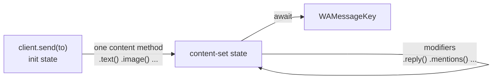

import { ProviderSupport } from "/snippets/provider-support.jsx"
import { Term } from "/snippets/glossary.jsx"

Look up every method on the builder that `client.send(to)` returns: what each one sends, its options and defaults, the errors it raises, and what happens on the Cloud API.

## Quick reference

| Method | Kind | Sends or does | On the Cloud API |
| --- | --- | --- | --- |
| [`text()`](#text) | Content | A text message, or a rich card with `rich: true` | Plain text only |
| [`htmlApp()`](#htmlapp) | Content | An HTML page that runs inside the bubble on WhatsApp Android | No |
| [`image()`](#image) | Content | A photo | Yes — `viewOnce` ignored |
| [`video()`](#video) | Content | A video or a looping GIF | Yes — `gifPlayback`, `viewOnce` ignored |
| [`videoNote()`](#videonote) | Content | A round video note | Arrives as a regular video |
| [`audio()`](#audio) | Content | A voice note or an audio file | Yes — `ptt` ignored |
| [`document()`](#document) | Content | A file to download | Yes |
| [`sticker()`](#sticker) | Content | A sticker made from an image or video | Yes |
| [`album()`](#album) | Content | 2–30 photos and videos grouped together | No |
| [`location()`](#location) | Content | A map pin | Yes |
| [`contact()`](#contact) | Content | A contact card | Yes |
| [`poll()`](#poll) | Content | A poll | No |
| [`buttons()`](#buttons) | Content | A message with tappable buttons | Partial |
| [`list()`](#list) | Content | A menu that opens a list of options | Yes |
| [`carousel()`](#carousel) | Content | Swipeable cards | No |
| [`template()`](#template) | Content | Text with up to 3 reply buttons | Yes |
| [`event()`](#event) | Content | An event invitation | No |
| [`groupInvite()`](#groupinvite) | Content | A group invite card | No |
| [`groupStatus()`](#groupstatus) | Content | A group status | No |
| [`product()`](#product) | Content | A product card | No |
| [`requestPhoneNumber()`](#requestphonenumber) | Content | A request for the recipient's number | No |
| [`sharePhoneNumber()`](#sharephonenumber) | Content | Your own number | No |
| [`limitSharing()`](#limitsharing) | Content | The chat's limit-sharing setting | No |
| [`to()`](#to) | Modifier | Changes the recipient | Yes |
| [`reply()`](#reply) | Modifier | Quotes a message | Yes, except interactive messages |
| [`mentions()`](#mentions) | Modifier | Tags people | Ignored |
| [`mentionAll()`](#mentionall) | Modifier | Tags everyone in a group | Ignored |
| [`audience()`](#audience) | Modifier | Picks who sees a status | No |
| [`disappearing()`](#disappearing) | Modifier | Makes the message disappear | Ignored |
| [`then()`](#then) | Send | Sends — what `await` calls | — |

## How a send works



1. `client.send(to)` returns a builder in the `init` state. If the client isn't connected, it throws `ZaileysBuilderError` with code `INVALID_OPTIONS` (`client not connected`) right away.
2. Call **one** content method. It moves the builder to `content-set`. TypeScript won't let you call a second content method or `await` a builder that has no content.
3. Add modifiers in any order, before or after the content method.
4. `await` the builder. It sends, then resolves to the new message's `WAMessageKey` — keep it to [edit, delete, react to, or pin](/messaging/edit-delete-react) the message later.

```ts
client.on('text', async (msg) => {
  if (msg.text !== 'book') return
  const key = await client
    .send(msg.roomId ?? msg.senderId)
    .text('Your table for 4 is booked for 7pm tonight.')
    .reply(msg.message())
  console.log('Sent message', key.id)
})
```

<Warning>
  Every `await` (or `.then()`) sends the message again. Await a builder once and keep the key, not the builder.
</Warning>

### What happens when you await

1. A bare phone number is looked up on WhatsApp (WhatsApp Web only) — `USERNAME_NOT_FOUND` if it isn't registered.
2. The chat's disappearing timer is applied, unless you called `disappearing()`.
3. `audience()` is checked against the recipient — `INVALID_RECIPIENT`.
4. Media is loaded and converted — `MEDIA_LOAD_FAILED` or `INVALID_OPTIONS`.
5. Group-only content is checked against the recipient — `INVALID_RECIPIENT`.
6. A status to `status@broadcast` without `audience()` is refused — `INVALID_OPTIONS`.
7. The message is sent — `SEND_FAILED` if WhatsApp refuses it, with the original error on `error.cause`.

Content methods that don't read files — `text`, `poll`, `location`, `contact`, `buttons`, `list`, `carousel`, `template`, `event`, `groupInvite`, and `groupStatus` with text — check their arguments as soon as you call them and throw straight away. Methods that load files check theirs when you await. A `try`/`catch` around the whole `await client.send(...)...` statement catches both.

### Choose the recipient

`to` is a <Term id="jid" /> or a bare phone number:

- **A JID** — ending in `@s.whatsapp.net`, `@g.us`, `@lid`, `@newsletter`, `@broadcast`, or `@c.us` — is used as it is.
- **A bare number** such as `'6281234567890'` is looked up when you await, on WhatsApp Web. The result is cached per client. A number that isn't on WhatsApp rejects with `USERNAME_NOT_FOUND`: `username "6281234567890" not found`. On the Cloud API, the number goes to Meta as it is, and any `@…` suffix is removed.

Inside a handler, send to the chat a message came from with `msg.roomId ?? msg.senderId`. More in [Addresses & JIDs](/concepts/jids).

### Media sources

Every media argument has the type `MediaSource`, which is `string | Buffer | URL`:

| You pass | Zaileys |
| --- | --- |
| A string starting with `http://` or `https://`, or an `http(s):` `URL` | Downloads it, waiting at most 30 seconds |
| Any other string, or a `file:` `URL` | Reads the file, relative to the folder you started the bot from |
| A `Buffer` | Uses the bytes as they are |

The file type is read from the bytes, so you never pass it. A failed load rejects with `MEDIA_LOAD_FAILED` and a message such as `fetch https://example.com/cat.jpg failed with status 404` or `read ./cat.jpg failed: ENOENT: no such file or directory, open './cat.jpg'`.

## Content methods

### `text()`

```ts Signature
import type { TextOptions } from 'zaileys'

interface MessageBuilder<State> {
  text(content: string, opts?: TextOptions): MessageBuilder<'content-set'>
}
```

Sends a text message. With `rich: true`, the content is Markdown rendered as a rich AI-style card.

<ProviderSupport web={true} cloud="partial" note="Plain text only — rich: true fails on the Cloud API." />

<ParamField body="content" type="string" required>
  The message. WhatsApp formatting such as `*bold*`, `_italic_`, and `~strike~` works. With `rich: true`, it's Markdown — see [Rich responses](/messaging/rich-responses).
</ParamField>
<ParamField body="opts.rich" type="boolean" default="false">
  Render the content as a rich card. The options below only apply when this is `true`.
</ParamField>
<ParamField body="opts.title" type="string">
  A short label sent as the card's disclaimer line, such as your bot's name.
</ParamField>
<ParamField body="opts.footer" type="string">
  Small text added after every other block.
</ParamField>
<ParamField body="opts.sources" type="Array<[faviconUrl: string, url: string, text: string]>">
  Source chips, each with an icon, a link, and a display name.
</ParamField>

**Errors:** `EMPTY_CONTENT` — `text() requires a non-empty string`, for an empty or whitespace-only string. With `rich: true`: `INVALID_OPTIONS` — `text({ rich: true }) requires non-empty markdown content`. On the Cloud API, `rich: true` rejects with `SEND_FAILED`, and `error.cause.code` is `NOT_IMPLEMENTED`.

```ts
await client.send(jid).text('*Order #1042* is on its way. Track it at https://example.com/t/1042')
```

Guide: [Text & replies](/messaging/text).

### `htmlApp()`

```ts Signature
import type { HtmlAppOptions, SafeHtml } from 'zaileys'

interface MessageBuilder<State> {
  htmlApp(markup: string | SafeHtml, opts?: HtmlAppOptions): MessageBuilder<'content-set'>
}
```

Sends an HTML page that WhatsApp Android runs inside the message bubble, offline. Experimental: an undocumented WhatsApp format that iOS, WhatsApp Web, and Desktop don't render.

<ProviderSupport web={true} cloud={false} note="Rejects with SEND_FAILED on the Cloud API." />

<ParamField body="markup" type="string | SafeHtml" required>
  The page. Build it with the [`html`](/reference/utilities#html) tag so interpolated values are escaped.
</ParamField>
<ParamField body="opts.title" type="string">
  A small label above the card.
</ParamField>
<ParamField body="opts.height" type="number">
  Pins the card height in CSS pixels, from 1 to 4096, so the bubble stops jumping.
</ParamField>
<ParamField body="opts.device" type="string">
  The recipient's device, usually `ctx.senderDevice`. Only `'android'` gets the card.
</ParamField>
<ParamField body="opts.fallback" type="string">
  Plain text sent instead of the card when `device` isn't `'android'`.
</ParamField>
<ParamField body="opts.maxBytes" type="number" default="262144">
  The largest page accepted, in UTF-8 bytes.
</ParamField>
<ParamField body="opts.bypassDownload" type="boolean" default="true">
  Follow the card with an identical edit so it renders without WhatsApp's Download prompt. Costs one extra relay, and the card reloads when the recipient opens the keyboard — pass `false` for pages that keep state.
</ParamField>

**Errors:** `EMPTY_CONTENT` for empty markup. `INVALID_OPTIONS` for a bad `height`, `maxBytes`, or `fallback`, or a page over `maxBytes`. `INVALID_RECIPIENT` when `device` isn't Android and there's no `fallback`. On the Cloud API it rejects with `SEND_FAILED`, and `error.cause.code` is `NOT_IMPLEMENTED`.

```ts
import { html } from 'zaileys'

const title = 'Order #1042 shipped'
await client.send(jid).htmlApp(html`<h1>${title}</h1>`, { height: 80, device: ctx.senderDevice, fallback: title })
```

Guide: [HTML apps](/messaging/html-app).

### `image()`

```ts Signature
import type { ImageOptions, MediaSource } from 'zaileys'

interface MessageBuilder<State> {
  image(src: MediaSource, opts?: ImageOptions): MessageBuilder<'content-set'>
}
```

Sends a photo.

<ProviderSupport web={true} cloud={true} note="viewOnce is ignored on the Cloud API." />

<ParamField body="src" type="MediaSource" required>
  The photo, as a URL, a file path, or a `Buffer`.
</ParamField>
<ParamField body="opts.caption" type="string">
  Text shown under the photo.
</ParamField>
<ParamField body="opts.viewOnce" type="boolean" default="false">
  The recipient can open the photo only once. WhatsApp Web only.
</ParamField>

**Errors:** `MEDIA_LOAD_FAILED` when the file can't be loaded.

```ts
await client.send(jid).image('./menu/nasi-goreng.jpg', { caption: 'Nasi goreng spesial — Rp25.000' })
```

Guide: [Send a photo](/messaging/media#send-a-photo).

### `video()`

```ts Signature
import type { MediaSource, VideoOptions } from 'zaileys'

interface MessageBuilder<State> {
  video(src: MediaSource, opts?: VideoOptions): MessageBuilder<'content-set'>
}
```

Sends a video, or a silent looping "GIF" with `gifPlayback`.

<ProviderSupport web={true} cloud={true} note="gifPlayback, viewOnce, and ptv are ignored on the Cloud API." />

<ParamField body="src" type="MediaSource" required>
  A video file. Anything else is refused.
</ParamField>
<ParamField body="opts.caption" type="string">
  Text shown under the video.
</ParamField>
<ParamField body="opts.gifPlayback" type="boolean" default="false">
  Play silently in a loop, like a GIF. WhatsApp Web only.
</ParamField>
<ParamField body="opts.viewOnce" type="boolean" default="false">
  The recipient can watch it only once. WhatsApp Web only.
</ParamField>
<ParamField body="opts.ptv" type="boolean" default="false">
  Send as a round video note — the same as [`videoNote()`](#videonote).
</ParamField>

**Errors:** `INVALID_OPTIONS` — `video() expects a video source, got mime image/jpeg` when the file isn't a video. `MEDIA_LOAD_FAILED` when it can't be loaded.

```ts
await client.send(jid).video('./promo/flash-sale.mp4', { caption: 'Flash sale starts at 8pm' })
```

Guide: [Send a video](/messaging/media#send-a-video).

### `videoNote()`

```ts Signature
import type { MediaSource, VideoNoteOptions } from 'zaileys'

interface MessageBuilder<State> {
  videoNote(src: MediaSource, opts?: VideoNoteOptions): MessageBuilder<'content-set'>
}
```

Sends a round video note — the circular bubble you get by holding the camera button.

<ProviderSupport web={true} cloud="partial" note="Arrives as a regular video on the Cloud API." />

<ParamField body="src" type="MediaSource" required>
  A video file.
</ParamField>
<ParamField body="opts.viewOnce" type="boolean" default="false">
  The recipient can watch it only once. WhatsApp Web only.
</ParamField>

**Errors:** the same as [`video()`](#video) — the message still names `video()`.

```ts
await client.send(jid).videoNote('./hello.mp4')
```

Guide: [Send a round video note](/messaging/media#send-a-round-video-note).

### `audio()`

```ts Signature
import type { AudioOptions, MediaSource } from 'zaileys'

interface MessageBuilder<State> {
  audio(src: MediaSource, opts?: AudioOptions): MessageBuilder<'content-set'>
}
```

Sends a voice note (the default) or an audio file. Any common format is converted to Opus; voice notes also get a waveform.

<ProviderSupport web={true} cloud={true} note="ptt is ignored — the file arrives as an audio message." />

<ParamField body="src" type="MediaSource" required>
  An audio file: MP3, M4A, WAV, OGG, and so on.
</ParamField>
<ParamField body="opts.ptt" type="boolean" default="true">
  `true` sends a voice note; `false` sends an audio file with a player.
</ParamField>
<ParamField body="opts.seconds" type="number">
  The duration shown on the message. For voice notes it's measured automatically when you leave it out.
</ParamField>

**Errors:** `MEDIA_LOAD_FAILED` — `audio() transcode failed: …` when the file can't be converted, or when it can't be loaded. If only the waveform fails, the voice note is sent without one.

```ts
await client.send(jid).audio('./greetings/welcome.ogg')
await client.send(jid).audio('./jingle.mp3', { ptt: false })
```

Guide: [Send a voice note or an audio file](/messaging/media#send-a-voice-note-or-an-audio-file).

### `document()`

```ts Signature
import type { DocumentOptions, MediaSource } from 'zaileys'

interface MessageBuilder<State> {
  document(src: MediaSource, opts: DocumentOptions): MessageBuilder<'content-set'>
}
```

Sends any file for the recipient to download.

<ProviderSupport web={true} cloud={true} />

<ParamField body="src" type="MediaSource" required>
  The file.
</ParamField>
<ParamField body="opts.fileName" type="string" required>
  The name the recipient sees, including the extension.
</ParamField>
<ParamField body="opts.mimetype" type="string" default="detected from the file">
  The file type, such as `text/csv`. When it can't be detected, `application/octet-stream` is used.
</ParamField>
<ParamField body="opts.caption" type="string">
  Text shown under the document.
</ParamField>

**Errors:** `INVALID_OPTIONS` — `document() requires a non-empty fileName`. `MEDIA_LOAD_FAILED` when the file can't be loaded.

```ts
await client.send(jid).document('./invoices/0042.pdf', { fileName: 'Invoice-0042.pdf', caption: 'Your September invoice' })
```

Guide: [Send a document](/messaging/media#send-a-document).

### `sticker()`

```ts Signature
import type { MediaSource, StickerOptions } from 'zaileys'

interface MessageBuilder<State> {
  sticker(src: MediaSource, opts?: StickerOptions): MessageBuilder<'content-set'>
}
```

Turns an image, GIF, or video into a WebP sticker and sends it. A file that's already WebP is sent as it is, without resizing or reshaping.

<ProviderSupport web={true} cloud={true} />

<ParamField body="src" type="MediaSource" required>
  An image, GIF, video, or WebP file.
</ParamField>
<ParamField body="opts.animated" type="boolean" default="false">
  Mark the sticker as animated. Set it for GIF and video sources.
</ParamField>
<ParamField body="opts.shape" type="'default' | 'circle' | 'rounded' | 'oval'" default="'default'">
  Crop a still image to a shape.
</ParamField>
<ParamField body="opts.quality" type="number" default="60">
  Encoding quality. Higher is sharper and larger.
</ParamField>
<ParamField body="opts.packageName" type="string" default="the client's sticker default, else 'Zaileys Library'">
  Pack name. `pack` and `packname` are accepted as aliases.
</ParamField>
<ParamField body="opts.authorName" type="string" default="the client's sticker default, else 'https://github.com/zeative/zaileys'">
  Author name. `author` and `publisher` are accepted as aliases.
</ParamField>

**Errors:** `MEDIA_LOAD_FAILED` — `sticker() conversion failed: …`, or when the file can't be loaded.

```ts
await client.send(jid).sticker('./logo.png', { shape: 'circle', packageName: 'Toko Budi', authorName: 'tokobudi.id' })
```

Guide: [Send a sticker](/messaging/media#send-a-sticker). Set pack defaults once with the [`sticker` client option](/reference/client-options#stickermetadatatype).

### `album()`

```ts Signature
import type { AlbumItem } from 'zaileys'

interface MessageBuilder<State> {
  album(items: AlbumItem[]): MessageBuilder<'content-set'>
}
```

Sends 2 to 30 photos and videos as one grouped album. The send resolves to the key of the album's parent message. `reply()`, `mentions()`, `mentionAll()`, and `disappearing()` apply to the album.

<ProviderSupport web={true} cloud={false} note="Rejects with SEND_FAILED on the Cloud API." />

<ParamField body="items[].type" type="'image' | 'video'" required>
  The kind of media.
</ParamField>
<ParamField body="items[].src" type="MediaSource" required>
  The file.
</ParamField>
<ParamField body="items[].caption" type="string">
  Caption for this item.
</ParamField>

**Errors** (when you await):

- `INVALID_OPTIONS` — `album() requires a minimum of 2 items`, `album() accepts a maximum of 30 items`, or `album() item type must be 'image' or 'video', got …`.
- `SEND_FAILED` — `album parent send rejected`, or `album child send rejected`. For a child, `error.cause` holds `parentKey`, the item's `index`, and the original `error`.

```ts
await client.send(jid).album([
  { type: 'image', src: './trip/day-1.jpg', caption: 'Day 1: arrival' },
  { type: 'video', src: './trip/day-2.mp4', caption: 'Day 2: the volcano' },
])
```

Guide: [Send an album](/messaging/media#send-an-album).

### `location()`

```ts Signature
import type { LocationOptions } from 'zaileys'

interface MessageBuilder<State> {
  location(lat: number, lon: number, opts?: LocationOptions): MessageBuilder<'content-set'>
}
```

Sends a map pin.

<ProviderSupport web={true} cloud={true} />

<ParamField body="lat" type="number" required>
  Latitude, from -90 to 90.
</ParamField>
<ParamField body="lon" type="number" required>
  Longitude, from -180 to 180.
</ParamField>
<ParamField body="opts.name" type="string">
  Place name shown on the pin.
</ParamField>
<ParamField body="opts.address" type="string">
  Address shown under the name.
</ParamField>

**Errors:** `INVALID_OPTIONS` — `location() latitude must be within -90..90, got 91` or `location() longitude must be within -180..180, got …`.

```ts
await client.send(jid).location(-6.1754, 106.8272, { name: 'Monas', address: 'Gambir, Central Jakarta' })
```

Guide: [Send a location](/messaging/polls-and-more#send-a-location).

### `contact()`

```ts Signature
interface MessageBuilder<State> {
  contact(vcard: string): MessageBuilder<'content-set'>
}
```

Sends a contact card from a vCard string.

<ProviderSupport web={true} cloud={true} note="The Cloud API reads the FN, N, and TEL lines of the vCard." />

<ParamField body="vcard" type="string" required>
  A vCard. It must start with `BEGIN:VCARD`.
</ParamField>

**Errors:** `INVALID_OPTIONS` — `contact() requires a vcard string starting with BEGIN:VCARD`.

```ts
const vcard = `BEGIN:VCARD
VERSION:3.0
FN:Budi Santoso
TEL;type=CELL;waid=6281234567890:+62 812-3456-7890
END:VCARD`

await client.send(jid).contact(vcard)
```

Guide: [Send a contact card](/messaging/polls-and-more#send-a-contact-card).

### `poll()`

```ts Signature
import type { PollOptions } from 'zaileys'

interface MessageBuilder<State> {
  poll(question: string, options: string[], opts?: PollOptions): MessageBuilder<'content-set'>
}
```

Sends a poll.

<ProviderSupport web={true} cloud={false} note="Rejects with SEND_FAILED on the Cloud API." />

<ParamField body="question" type="string" required>
  The poll question.
</ParamField>
<ParamField body="options" type="string[]" required>
  2 to 12 answers, each non-empty and unique.
</ParamField>
<ParamField body="opts.multipleChoice" type="boolean" default="false">
  Let voters pick more than one answer. Otherwise they pick exactly one.
</ParamField>

**Errors:** `EMPTY_CONTENT` — `poll() requires a non-empty question`. `INVALID_OPTIONS` — `poll() requires a minimum of 2 options`, `poll() accepts a maximum of 12 options`, `poll options must be non-empty strings`, or `duplicate poll options: …`.

```ts
await client.send(jid).poll('Where should we eat on Friday?', ['Sate Senayan', 'Bakmi GM', 'Warung Tekko'], {
  multipleChoice: true,
})
```

Guide: [Send a poll](/messaging/polls-and-more#send-a-poll).

### `buttons()`

```ts Signature
import type { BottomSheetOptions, ButtonDef, InteractiveButton, LimitedTimeOfferOptions, MediaSource } from 'zaileys'

interface MessageBuilder<State> {
  buttons(
    buttons: Array<ButtonDef | InteractiveButton>,
    opts?: {
      text?: string
      title?: string
      subtitle?: string
      footer?: string
      image?: MediaSource
      video?: MediaSource
      bottomSheet?: BottomSheetOptions
      limitedTimeOffer?: LimitedTimeOfferOptions
    },
  ): MessageBuilder<'content-set'>
}
```

Sends a message with up to 10 tappable buttons.

<ProviderSupport web={true} cloud="partial" note="Cloud API: up to 3 reply buttons, or a single link button, with a text header only." />

<ParamField body="buttons" type="Array<ButtonDef | InteractiveButton>" required>
  1 to 10 buttons. Each needs a non-empty `text`, except `location`. The `type` decides the rest:

  | `type` | Extra fields | Tapping it |
  | --- | --- | --- |
  | `'reply'` (or no `type`) | `id` — required, unique | Sends the `id` back as a `button-click` event |
  | `'url'` | `url` — required; `webview?: boolean` | Opens the link |
  | `'copy'` | `code` — required | Copies the code |
  | `'call'` | `phone` — required | Calls the number |
  | `'reminder'` / `'cancel-reminder'` | `id?` — defaults to `text` | Sets or cancels a reminder |
  | `'location'` | `text?` | Asks the recipient to share their location |
  | `'address'` | `id?` — defaults to `text` | Asks the recipient for an address |
</ParamField>
<ParamField body="opts.text" type="string">
  The message body. Leave it out for a blank body.
</ParamField>
<ParamField body="opts.title" type="string">
  Header title.
</ParamField>
<ParamField body="opts.subtitle" type="string">
  Header subtitle. WhatsApp Web only.
</ParamField>
<ParamField body="opts.footer" type="string">
  Small text under the body.
</ParamField>
<ParamField body="opts.image" type="MediaSource">
  A header image. Wins over `video` when you pass both. WhatsApp Web only.
</ParamField>
<ParamField body="opts.video" type="MediaSource">
  A header video. WhatsApp Web only.
</ParamField>
<ParamField body="opts.bottomSheet" type="BottomSheetOptions">
  Show a few buttons in the chat and the rest in a sheet: `buttonsLimit`, `buttonTitle`, `listTitle`, `dividers`. WhatsApp Web only. [Details](/messaging/interactive#collapse-extra-buttons-into-a-sheet)
</ParamField>
<ParamField body="opts.limitedTimeOffer" type="LimitedTimeOfferOptions">
  A countdown banner: `text`, `url`, `copyCode`, and `expiresAt` in Unix **seconds**. WhatsApp Web only. [Details](/messaging/interactive#show-a-countdown-offer)
</ParamField>

**Errors:** `INVALID_OPTIONS` — `buttons() requires at least one button`, `buttons() accepts at most 10 buttons`, `button text must be a non-empty string`, `reply button requires a non-empty id`, `duplicate button id: …`, `url button requires a non-empty url`, `copy button requires a non-empty code`, `call button requires a non-empty phone`, or `unknown button type: …`. Header media that fails to upload rejects with `SEND_FAILED` — `interactive media upload failed`.

On the Cloud API, anything other than 1–3 reply buttons or a single `url` button — including a header image or video — rejects with `SEND_FAILED`, and `error.cause.code` is `NOT_IMPLEMENTED`.

```ts
await client.send(jid).buttons(
  [
    { id: 'order:1042:confirm', text: 'Confirm order' },
    { type: 'url', text: 'Track package', url: 'https://example.com/t/1042' },
    { type: 'copy', text: 'Copy voucher', code: 'HEMAT20' },
  ],
  { title: 'Order #1042', text: 'Total: Rp185.000', footer: 'Toko Budi' },
)
```

Guide: [Buttons & lists](/messaging/interactive).

### `list()`

```ts Signature
import type { ListOptions } from 'zaileys'

interface MessageBuilder<State> {
  list(opts: ListOptions): MessageBuilder<'content-set'>
}
```

Sends a message with one button that opens a list of options.

<ProviderSupport web={true} cloud={true} />

<ParamField body="opts.buttonText" type="string" required>
  Label of the button that opens the list.
</ParamField>
<ParamField body="opts.sections" type="ListSection[]" required>
  At least one section. Each has a `title` and at least one row; each row has an `id`, a `title`, and an optional `description`. At most 10 rows across all sections, and every row `id` must be unique.
</ParamField>
<ParamField body="opts.title" type="string">
  Header title.
</ParamField>
<ParamField body="opts.description" type="string">
  The message body.
</ParamField>
<ParamField body="opts.footerText" type="string">
  Small text under the body.
</ParamField>

**Errors:** `INVALID_OPTIONS` — `list() requires a non-empty buttonText`, `list() requires at least one section`, `each list section requires at least one row`, `list row id must be a non-empty string`, `list row title must be a non-empty string`, `duplicate list row id: …`, or `list() accepts at most 10 rows total`.

```ts
await client.send(jid).list({
  title: 'Menu',
  description: 'What would you like today?',
  buttonText: 'See menu',
  sections: [
    { title: 'Mains', rows: [{ id: 'nasi-goreng', title: 'Nasi goreng', description: 'Rp25.000' }] },
    { title: 'Drinks', rows: [{ id: 'es-teh', title: 'Es teh manis', description: 'Rp5.000' }] },
  ],
})
```

Guide: [Send a list](/messaging/interactive#send-a-list).

### `carousel()`

```ts Signature
import type { ButtonDef, InteractiveButton, MediaSource } from 'zaileys'

interface MessageBuilder<State> {
  carousel(
    cards: Array<{
      title?: string
      subtitle?: string
      body?: string
      footer?: string
      image?: MediaSource
      video?: MediaSource
      buttons?: Array<ButtonDef | InteractiveButton>
    }>,
    opts?: { text?: string },
  ): MessageBuilder<'content-set'>
}
```

Sends up to 10 cards the recipient swipes through, each with its own media and buttons.

<ProviderSupport web={true} cloud={false} note="Rejects with SEND_FAILED on the Cloud API." />

<ParamField body="cards" type="CarouselCard[]" required>
  1 to 10 cards. Each takes `title`, `subtitle`, `body`, `footer`, an `image` or `video` header, and up to 10 `buttons` following the [`buttons()`](#buttons) rules.
</ParamField>
<ParamField body="opts.text" type="string">
  Text shown above the cards.
</ParamField>

**Errors:** `INVALID_OPTIONS` — `carousel() requires at least one card`, `carousel() accepts at most 10 cards`, plus the button errors from [`buttons()`](#buttons).

```ts
await client.send(jid).carousel(
  [
    { title: 'Kopi Susu', body: 'Rp18.000', image: './menu/kopi-susu.jpg', buttons: [{ id: 'add:kopi-susu', text: 'Add' }] },
    { title: 'Matcha Latte', body: 'Rp24.000', image: './menu/matcha.jpg', buttons: [{ id: 'add:matcha', text: 'Add' }] },
  ],
  { text: 'Our best sellers' },
)
```

Guide: [Send a carousel](/messaging/interactive#send-a-carousel).

### `template()`

```ts Signature
import type { TemplateOptions } from 'zaileys'

interface MessageBuilder<State> {
  template(opts: TemplateOptions): MessageBuilder<'content-set'>
}
```

A shortcut for a message with 1–3 reply buttons. The header is added to the body as a bold first line. This isn't a Meta message template — for those, use [`client.sendTemplate()`](/reference/client#sendtemplate).

<ProviderSupport web={true} cloud={true} note="Sent as reply buttons on the Cloud API." />

<ParamField body="opts.body" type="string" required>
  The message text.
</ParamField>
<ParamField body="opts.buttons" type="ButtonDef[]" required>
  1 to 3 reply buttons, each `{ id, text }`.
</ParamField>
<ParamField body="opts.header" type="string">
  Shown in bold above the body.
</ParamField>
<ParamField body="opts.footer" type="string">
  Small text under the body.
</ParamField>

**Errors:** `INVALID_OPTIONS` — `template() requires a non-empty body`, `template() requires at least one button`, `template() accepts at most 3 buttons`, plus the reply-button errors from [`buttons()`](#buttons).

```ts
await client.send(jid).template({
  header: 'Delivery update',
  body: 'Your order arrives tomorrow between 9am and 12pm.',
  footer: 'Toko Budi',
  buttons: [
    { id: 'slot:ok', text: 'That works' },
    { id: 'slot:change', text: 'Change time' },
  ],
})
```

Guide: [Send a quick template](/messaging/interactive#send-a-quick-template).

### `event()`

```ts Signature
import type { EventOptions } from 'zaileys'

interface MessageBuilder<State> {
  event(opts: EventOptions): MessageBuilder<'content-set'>
}
```

Sends an event invitation with a start time and, optionally, a place or a call link.

<ProviderSupport web={true} cloud={false} note="Rejects with SEND_FAILED on the Cloud API." />

<ParamField body="opts.name" type="string" required>
  Event name.
</ParamField>
<ParamField body="opts.startAt" type="Date | number" required>
  Start time, as a `Date` or epoch milliseconds. Rounded down to the second.
</ParamField>
<ParamField body="opts.endAt" type="Date | number">
  End time, in the same form.
</ParamField>
<ParamField body="opts.description" type="string">
  Details shown on the invitation.
</ParamField>
<ParamField body="opts.location" type="{ latitude: number; longitude: number; name?: string; address?: string }">
  Where the event happens.
</ParamField>
<ParamField body="opts.call" type="'audio' | 'video'">
  Attach a WhatsApp call link of this kind.
</ParamField>
<ParamField body="opts.canceled" type="boolean">
  Mark the event as canceled.
</ParamField>

**Errors:** `INVALID_OPTIONS` — `event() requires a non-empty name`, `event() startAt must be a valid Date or epoch ms`, or `event() endAt must be a valid Date or epoch ms`.

```ts
await client.send('120363025246125486@g.us').event({
  name: 'Monthly team dinner',
  startAt: new Date('2026-10-02T19:00:00+07:00'),
  endAt: new Date('2026-10-02T21:00:00+07:00'),
  location: { latitude: -6.2297, longitude: 106.8295, name: 'Plaza Senayan' },
})
```

Guide: [Send a group event](/messaging/polls-and-more#send-a-group-event).

### `groupInvite()`

```ts Signature
import type { GroupInviteOptions } from 'zaileys'

interface MessageBuilder<State> {
  groupInvite(opts: GroupInviteOptions): MessageBuilder<'content-set'>
}
```

Sends a card the recipient taps to join a group.

<ProviderSupport web={true} cloud={false} note="Rejects with SEND_FAILED on the Cloud API." />

<ParamField body="opts.jid" type="string" required>
  The group's JID, ending in `@g.us`.
</ParamField>
<ParamField body="opts.code" type="string" required>
  The invite code, from `client.group.inviteCode(jid)`.
</ParamField>
<ParamField body="opts.subject" type="string" default="''">
  Group name shown on the card.
</ParamField>
<ParamField body="opts.caption" type="string" default="''">
  Text shown with the invite.
</ParamField>
<ParamField body="opts.expiresAt" type="number" default="3 days from now">
  When the invite expires, as a Unix timestamp in **seconds**.
</ParamField>
<ParamField body="opts.thumbnail" type="Buffer">
  A JPEG shown on the card, such as the group picture.
</ParamField>

**Errors:** `INVALID_OPTIONS` — `groupInvite() requires a group jid ending in @g.us` or `groupInvite() requires an invite code`.

```ts
const groupJid = '120363025246125486@g.us'
const code = await client.group.inviteCode(groupJid)

await client.send(jid).groupInvite({ jid: groupJid, code, subject: 'Toko Budi Resellers', caption: 'Join us!' })
```

Guide: [Send a group invite card](/messaging/polls-and-more#send-a-group-invite-card).

### `groupStatus()`

```ts Signature
import type { GroupStatusOptions, GroupStatusRepostOptions, GroupStatusSource } from 'zaileys'

interface MessageBuilder<State> {
  groupStatus(text: string, opts?: GroupStatusOptions): MessageBuilder<'content-set'>
  groupStatus(source: GroupStatusSource, opts?: GroupStatusRepostOptions): MessageBuilder<'content-set'>
}
```

Posts a status to a group — either new text, or an existing message or new media. The recipient must be a group.

<ProviderSupport web={true} cloud={false} note="Rejects with SEND_FAILED on the Cloud API." />

#### Post text

<ParamField body="text" type="string" required>
  The status text.
</ParamField>
<ParamField body="opts.backgroundColor" type="string | number">
  `#RGB`, `#RRGGBB`, or `#AARRGGBB` (the `#` is optional), or an ARGB integer.
</ParamField>
<ParamField body="opts.font" type="GroupStatusFont | number">
  `'system'`, `'system-text'`, `'fb-script'`, `'system-bold'`, `'morningbreeze'`, `'calistoga'`, `'exo2'`, or `'courierprime'` — or a raw font number.
</ParamField>

```ts
await client.send('120363025246125486@g.us').groupStatus('Meeting moved to 3pm', {
  backgroundColor: '#128C7E',
  font: 'calistoga',
})
```

#### Repost a message or post media

<ParamField body="source" type="GroupStatusSource" required>
  One of: an incoming `msg` (a `MessageContext`), a raw `WAMessage`, or new media as `{ image | video | audio, caption?, ptt? }`. Text, image, video, and audio messages can be reposted. Media is always downloaded and uploaded again, because a status needs its own upload.
</ParamField>
<ParamField body="opts.caption" type="string">
  Replaces the original caption or text. Voice notes have no caption.
</ParamField>

```ts
await client.send('120363025246125486@g.us').groupStatus({ image: './promo/poster.jpg', caption: 'Promo hari ini' })
```

**Errors:**

- `INVALID_RECIPIENT` — `groupStatus() can only be sent to a group jid ending in @g.us`.
- `EMPTY_CONTENT` — `groupStatus() requires a non-empty string`, or `groupStatus() source has no repostable content`.
- `INVALID_OPTIONS` — a bad color (`groupStatus() backgroundColor must be #RGB, #RRGGBB or #AARRGGBB, got …`), an unknown font (`groupStatus() font must be one of …`), or a message that can't be reposted (`groupStatus() cannot repost …; supported: text, image, video, audio`).
- `MEDIA_LOAD_FAILED` — `groupStatus() could not download the source media` or `groupStatus() media upload failed`.

Guide: [Post a group status](/messaging/polls-and-more#post-a-group-status).

### `product()`

```ts Signature
import type { ProductOptions } from 'zaileys'

interface MessageBuilder<State> {
  product(opts: ProductOptions): MessageBuilder<'content-set'>
}
```

Sends a product card from a WhatsApp Business catalog.

<ProviderSupport web={true} cloud={false} note="Rejects with SEND_FAILED on the Cloud API." />

<ParamField body="opts.image" type="MediaSource" required>
  Product photo.
</ParamField>
<ParamField body="opts.title" type="string" required>
  Product name.
</ParamField>
<ParamField body="opts.businessOwnerId" type="string" required>
  JID of the business that owns the catalog.
</ParamField>
<ParamField body="opts.price" type="number">
  Price in currency units — `50` means 50.00.
</ParamField>
<ParamField body="opts.currency" type="string">
  Currency code, such as `'IDR'` or `'USD'`.
</ParamField>
<ParamField body="opts.description" type="string">
  Product description.
</ParamField>
<ParamField body="opts.productId" type="string">
  The product's ID in your catalog.
</ParamField>
<ParamField body="opts.retailerId" type="string">
  Your own SKU.
</ParamField>
<ParamField body="opts.url" type="string">
  Product link.
</ParamField>
<ParamField body="opts.body" type="string">
  Message text sent with the card.
</ParamField>
<ParamField body="opts.footer" type="string">
  Small text under the card.
</ParamField>

**Errors:** `INVALID_OPTIONS` — `product() requires a non-empty title` or `product() requires businessOwnerId`. `MEDIA_LOAD_FAILED` when the image can't be loaded.

```ts
await client.send(jid).product({
  image: './catalog/batik-shirt.jpg',
  title: 'Batik shirt, navy',
  businessOwnerId: '6281234567890@s.whatsapp.net',
  price: 249000,
  currency: 'IDR',
})
```

Guide: [Send a product card](/messaging/polls-and-more#send-a-product-card).

### `requestPhoneNumber()`

```ts Signature
interface MessageBuilder<State> {
  requestPhoneNumber(): MessageBuilder<'content-set'>
}
```

Asks the recipient to share their phone number. No arguments.

<ProviderSupport web={true} cloud={false} />

```ts
await client.send('115362955808779@lid').requestPhoneNumber()
```

Guide: [Ask for or share a phone number](/messaging/polls-and-more#ask-for-or-share-a-phone-number).

### `sharePhoneNumber()`

```ts Signature
interface MessageBuilder<State> {
  sharePhoneNumber(): MessageBuilder<'content-set'>
}
```

Shares the bot's own phone number with the recipient. No arguments.

<ProviderSupport web={true} cloud={false} />

```ts
await client.send('115362955808779@lid').sharePhoneNumber()
```

### `limitSharing()`

```ts Signature
interface MessageBuilder<State> {
  limitSharing(enabled?: boolean): MessageBuilder<'content-set'>
}
```

Turns WhatsApp's limit-sharing setting on or off for the chat.

<ProviderSupport web={true} cloud={false} />

<ParamField body="enabled" type="boolean" default="true">
  `true` turns it on; `false` turns it off.
</ParamField>

```ts
await client.send(jid).limitSharing()
await client.send(jid).limitSharing(false)
```

Guide: [Limit sharing in a chat](/messaging/polls-and-more#limit-sharing-in-a-chat).

## Modifiers

Modifiers change how the message is sent. You can call them before or after the content method, and they keep the builder's state.

### `to()`

```ts Signature
interface MessageBuilder<State> {
  to(recipient: string): MessageBuilder<'init'>
}
```

Replaces the recipient. Only available before the content method. Unlike `client.send()`, it never looks up a bare phone number, so pass a full JID. You need it in [`client.scheduleAt()`](/reference/client#scheduleat), whose builder starts without a recipient.

<ProviderSupport web={true} cloud={true} />

<ParamField body="recipient" type="string" required>
  The new recipient's JID.
</ParamField>

```ts
await client.scheduleAt(new Date('2026-10-01T08:00:00+07:00'), (b) =>
  b.to('6281234567890@s.whatsapp.net').text('Good morning! Your subscription renews today.'),
)
```

### `reply()`

```ts Signature
import type { WAMessage, WAMessageKey } from 'zaileys'

interface MessageBuilder<State> {
  reply(quoted: WAMessage | WAMessageKey): MessageBuilder<State>
}
```

Quotes a message, like swiping to reply.

<ProviderSupport web={true} cloud="partial" note="Dropped on interactive messages on the Cloud API." />

<ParamField body="quoted" type="WAMessage | WAMessageKey" required>
  The message to quote. Pass the full message — `msg.message()` in a handler — so the quote shows its text. A key alone is enough for text and media, but on buttons, lists, carousels, templates, invites, group statuses, and rich text it's ignored.
</ParamField>

**Errors:** `INVALID_OPTIONS` — `reply() requires a quoted message or key`, for `null` or `undefined`.

```ts
client.on('text', async (msg) => {
  if (msg.text === 'hours') {
    await client.send(msg.roomId ?? msg.senderId).text('Open 9am–9pm, Monday to Saturday.').reply(msg.message())
  }
})
```

Guide: [Reply to a message](/messaging/text#reply-to-a-message).

### `mentions()`

```ts Signature
interface MessageBuilder<State> {
  mentions(jids: string[]): MessageBuilder<State>
}
```

Tags people. Put the matching `@number` in the text too, so the tag shows as a name. Repeated calls add to the list without duplicates.

<ProviderSupport web={true} cloud={false} note="Ignored on the Cloud API." />

<ParamField body="jids" type="string[]" required>
  The JIDs to tag. Each must contain `@`.
</ParamField>

**Errors:** `INVALID_OPTIONS` — `mentions() requires at least one jid`, or `invalid jid: …`.

```ts
await client
  .send('120363025246125486@g.us')
  .text('@6281234567890 your order is ready for pickup')
  .mentions(['6281234567890@s.whatsapp.net'])
```

Guide: [Mention people](/messaging/text#mention-people).

### `mentionAll()`

```ts Signature
interface MessageBuilder<State> {
  mentionAll(): MessageBuilder<State>
}
```

Tags everyone in the group without listing them.

<ProviderSupport web={true} cloud={false} note="Ignored on the Cloud API." />

```ts
await client.send('120363025246125486@g.us').text('Shop closes early today at 5pm.').mentionAll()
```

Guide: [Mention everyone in a group](/messaging/text#mention-everyone-in-a-group).

### `audience()`

```ts Signature
interface MessageBuilder<State> {
  audience(jids: string[]): MessageBuilder<State>
}
```

Picks who sees a personal status sent to `status@broadcast`. Required for a status: without it, WhatsApp accepts the status but shows it to nobody, so Zaileys refuses to send. Repeated calls add to the list without duplicates.

<ProviderSupport web={true} cloud={false} />

<ParamField body="jids" type="string[]" required>
  The people who can see the status. Each must contain `@`.
</ParamField>

**Errors:**

- `INVALID_OPTIONS` — `audience() requires at least one jid`, or `invalid jid: …`, when you call it.
- `INVALID_RECIPIENT` — `audience() only applies to status@broadcast, not …`, when the recipient is anything else.
- `INVALID_OPTIONS` — `a status sent to status@broadcast needs audience([...]); without it WhatsApp accepts the message but shows it to nobody`, when you send a status without it.

```ts
await client
  .send('status@broadcast')
  .image('./promo/poster.jpg', { caption: 'Diskon 20% hari ini' })
  .audience(['6281234567890@s.whatsapp.net', '6289876543210@s.whatsapp.net'])
```

Guide: [Post a personal status](/messaging/polls-and-more#post-a-personal-status).

### `disappearing()`

```ts Signature
interface MessageBuilder<State> {
  disappearing(seconds: number): MessageBuilder<State>
}
```

Makes this message disappear after the given time. You rarely need it: Zaileys learns each chat's disappearing timer from incoming messages and applies it to everything you send there. Call it only to use a different timer.

<ProviderSupport web={true} cloud={false} note="Ignored on the Cloud API." />

<ParamField body="seconds" type="number" required>
  A positive whole number — for example `86400` for 24 hours or `604800` for 7 days.
</ParamField>

**Errors:** `INVALID_OPTIONS` — `disappearing() requires a positive integer duration`.

```ts
await client.send(jid).text('Your one-time code is 482913').disappearing(86400)
```

Guide: [Send disappearing messages](/messaging/text#send-disappearing-messages).

### `then()`

```ts Signature
import type { WAMessageKey } from 'zaileys'

interface MessageBuilder<State> {
  then<T = WAMessageKey>(
    onResolved: (key: WAMessageKey) => T,
    onRejected?: (err: unknown) => T | PromiseLike<T>,
  ): Promise<T>
}
```

Sends the message. This is what `await` calls, which is why a builder can be awaited. Only available once content is set. Each call sends again.

<ProviderSupport web={true} cloud={true} />

<ResponseField name="key" type="WAMessageKey">
  The sent message's key: `id`, `remoteJid`, and `fromMe`. For an album, it's the parent message's key.
</ResponseField>

```ts
client.send(jid).text('Payment received, thank you!').then(
  (key) => console.log('Sent', key.id),
  (error) => console.error('Send failed', error),
)
```

## Errors

Every builder error is a `ZaileysBuilderError` with one of these codes:

| Code | What went wrong | How to fix it |
| --- | --- | --- |
| `INVALID_OPTIONS` | The client isn't connected (`client not connected`), or an argument breaks a rule listed above. | Wait for the `connect` event, then check the message against the method's rules. |
| `EMPTY_CONTENT` | Empty text, poll question, or group status — or a builder awaited with no content (`no content set`). | Pass non-empty content, and call one content method before awaiting. |
| `MEDIA_LOAD_FAILED` | A file couldn't be downloaded, read, or converted. | Open the URL in a browser, check the path from the folder you started the bot in, and try another file. |
| `INVALID_RECIPIENT` | Group-only content sent outside a group, or `audience()` used outside `status@broadcast`. | Send to a JID ending in `@g.us`, or remove `audience()`. |
| `USERNAME_NOT_FOUND` | A bare phone number isn't registered on WhatsApp. | Check the number, country code first. |
| `SEND_FAILED` | WhatsApp or the Cloud API refused the message, or returned no key. | Read `error.cause` for the original error. On the Cloud API, `error.cause.code === 'NOT_IMPLEMENTED'` means the content type isn't supported there. |
| `MESSAGE_NOT_FOUND` | [`client.forward()`](/reference/client#forward) couldn't find the message in the store. | Forward messages the store still holds, or use a persistent [store](/data/storage). |

Fall back to plain text when the Cloud API can't send something:

```ts
import { ZaileysBuilderError, ZaileysCloudError } from 'zaileys'

try {
  await client.send(jid).poll('Lunch today?', ['Soto', 'Rawon'])
} catch (error) {
  const unsupported =
    error instanceof ZaileysBuilderError &&
    error.cause instanceof ZaileysCloudError &&
    error.cause.code === 'NOT_IMPLEMENTED'
  if (unsupported) await client.send(jid).text('Lunch today? Reply 1 for Soto or 2 for Rawon.')
  else throw error
}
```

More in [Error handling](/data/error-handling) and [Errors](/reference/errors).

## Common questions

<AccordionGroup>
  <Accordion title="Why did my message arrive twice?">
    The builder was awaited twice — for example, stored in a variable and awaited in two places. Each `await` sends. Keep the key it resolves to instead.
  </Accordion>
  <Accordion title="Can I build a message first and send it later?">
    Yes. Nothing is sent until you await, so you can pass a builder around. For a specific time, use [`client.scheduleAt()`](/reference/client#scheduleat), which keeps the message across restarts when your store supports it.
  </Accordion>
  <Accordion title="Can I send to a number that isn't a JID?">
    Yes: `client.send('6281234567890')`. On WhatsApp Web it's looked up when you await; on the Cloud API it's passed to Meta as it is. `.to()` doesn't do the lookup — give it a full JID.
  </Accordion>
  <Accordion title="Which methods work on the Cloud API?">
    See the last column of the [Quick reference](#quick-reference). The Cloud API sends text, media, locations, contacts, reactions, lists, up to 3 reply buttons, and single link buttons.
  </Accordion>
</AccordionGroup>

## Next steps

<CardGroup cols={2}>
  <Card title="Text & replies" icon="message-square" href="/messaging/text">
    Replies, mentions, and disappearing messages in practice.
  </Card>
  <Card title="Send media" icon="image" href="/messaging/media">
    Photos, voice notes, documents, stickers, and albums.
  </Card>
  <Card title="Buttons & lists" icon="mouse-pointer-click" href="/messaging/interactive">
    Interactive messages and handling taps.
  </Card>
  <Card title="Client reference" icon="cpu" href="/reference/client">
    Edit, delete, react, forward, and everything else.
  </Card>
</CardGroup>
