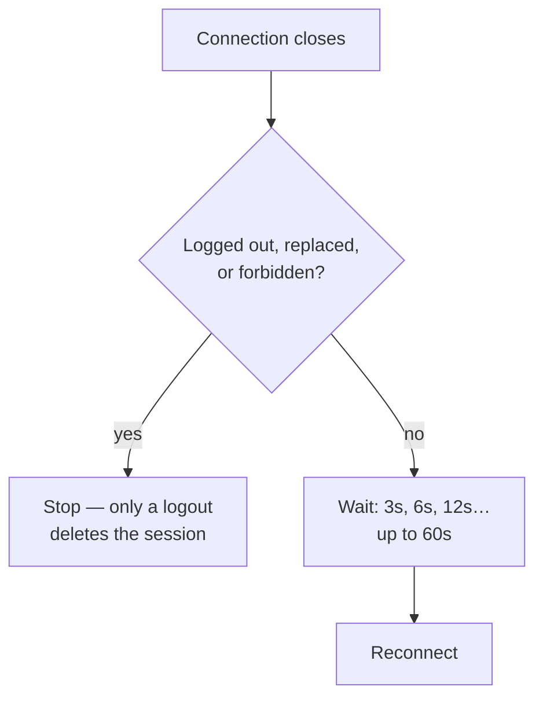

import { ProviderSupport } from "/snippets/provider-support.jsx"
import { Term } from "/snippets/glossary.jsx"

This page covers running a bot on the Unofficial provider: logging in, keeping the login, reconnecting, and keeping the number safe.

<ProviderSupport web={true} cloud={false} note="The Cloud API logs in with an access token — see Cloud setup." />

## Quick reference

| To | Use | What happens |
| --- | --- | --- |
| Log in by scanning a code | [The default settings](#log-in-with-a-qr-code) | A QR code prints in your terminal |
| Log in without a camera | [`authType: 'pairing'`](#log-in-with-a-pairing-code) | An 8-character code prints for you to type on the phone |
| Keep the login across restarts | [`sessionId`, `auth`](#keep-the-session) | The <Term id="session" /> is saved to `.zaileys/auth/<sessionId>` |
| Start over with a new login | [`client.logout()`](#force-a-new-login) | The device is unlinked and the saved session deleted |
| Change how reconnects work | [`reconnect`](#stay-connected) | Retries follow your delays and attempt limit |
| Stop endless login attempts | [`authGuard`](#limit-login-attempts) | Zaileys gives up after 5 QR codes or 3 pairing codes |
| Lower the ban risk | [`operationGuard`, `presence`](#avoid-bans) | Group actions and typing updates are spaced out |
| Close the connection | [`client.disconnect()`](#disconnect-or-log-out) | The bot goes offline, and the session stays saved |

## Log in with a QR code

QR login is the default, so a plain client is enough:

```ts bot.ts
import { Client } from 'zaileys'

const client = new Client()

client.on('connect', ({ me }) => {
  console.log('Linked as', me.id)
})
```

Run `npx tsx bot.ts`. The terminal shows a QR code and:

```text
[zaileys] Connecting to WhatsApp (session: default)...
[zaileys] Scan the QR code above with WhatsApp > Linked devices to authenticate.
```

On the bot's phone, open **WhatsApp → Settings → Linked devices → Link a device** and scan it. When linking finishes:

```text
[zaileys] Connected as 6281234567890@s.whatsapp.net.
```

Each QR code is valid for 60 seconds, and Zaileys prints a new one when it expires. After 5 codes go unscanned, it stops trying ([why](#limit-login-attempts)).

### Show the QR code somewhere else

To show the code on a web page or send it to an admin, turn off the terminal QR and listen for the `qr` event:

```ts bot.ts
import { Client } from 'zaileys'

const client = new Client({ qrTerminal: false })

client.on('qr', ({ qrString, expiresAt }) => {
  const secondsLeft = Math.round((expiresAt - Date.now()) / 1000)
  console.log(`New QR code, valid for ${secondsLeft}s:`, qrString)
})
```

`qrString` is the text a QR code encodes. Render it with any QR library, and replace the image each time the event fires.

<ResponseField name="qrString" type="string">
  The login code to turn into a QR image.
</ResponseField>
<ResponseField name="expiresAt" type="number">
  When the code expires, in milliseconds since the epoch — 60 seconds after it was issued.
</ResponseField>
<ResponseField name="sessionId" type="string">
  The session this code logs in.
</ResponseField>

<ParamField body="qrTerminal" type="boolean" default="true">
  Print the QR code in the terminal.
</ParamField>
<ParamField body="statusLog" type="boolean" default="true">
  Print the `[zaileys] …` status lines. They go to stderr, so they don't mix with your own stdout output.
</ParamField>

## Log in with a pairing code

On a server with no screen, or when you can't scan, link with a <Term id="pairing-code" />. Give Zaileys the bot's own number:

```ts bot.ts
import { Client } from 'zaileys'

const client = new Client({ authType: 'pairing', phoneNumber: '6281234567890' })
```

The terminal prints:

```text
[zaileys] Pairing code: ABCD1234 — enter it in WhatsApp > Linked devices > Link with phone number.
```

On the phone, open **WhatsApp → Settings → Linked devices → Link a device → Link with phone number instead**, and type the code. It's valid for 60 seconds.

To show the code somewhere else, listen for the `pairing-code` event. It carries `code`, `expiresAt`, and `sessionId`:

```ts
client.on('pairing-code', ({ code }) => {
  console.log('Type this code on the phone:', code)
})
```

<ParamField body="authType" type="'qr' | 'pairing'" default="'qr'">
  How to log in when there's no saved session.
</ParamField>
<ParamField body="phoneNumber" type="string">
  The bot's own number, country code first. Required when `authType` is `'pairing'`.
</ParamField>

### Write the phone number correctly

Zaileys removes spaces, dashes, parentheses, and `+`, then expects 8 to 15 digits starting with the country code:

| You pass | Zaileys uses | Result |
| --- | --- | --- |
| `'6281234567890'` | `6281234567890` | ✓ Works |
| `'+62 812-3456-7890'` | `6281234567890` | ✓ Works |
| `'081234567890'` | `081234567890` | ✗ No country code, so WhatsApp can't match the number. Replace the leading `0` with the country code. |
| `'62-812'` | `62812` | ✗ Too short: `phoneNumber must be E.164 with country code` |
| `'62812abc890'` | `62812abc890` | ✗ Not all digits: `phoneNumber must be E.164 with country code` |

### When no pairing code appears

| Message | Cause | How to fix it |
| --- | --- | --- |
| `phoneNumber is required when authType is "pairing"` | `authType: 'pairing'` without `phoneNumber`. | Add the bot's number. |
| `phoneNumber is required` | `phoneNumber` is only spaces. | Pass the full number. |
| `phoneNumber must be E.164 with country code` | Letters are left after cleanup, or the number isn't 8–15 digits. | Follow the table above. |
| `failed to request pairing code: …` | WhatsApp refused the request. The rest of the message is WhatsApp's reason. | Check the number is the bot's own WhatsApp number, then try again later. |

The first error surfaces through the `error` event. The other three happen while the code is requested and go to the logger at `warn` level, which is silent by default. To see them, run the bot with the `ZAILEYS_DEBUG` environment variable:

```bash
ZAILEYS_DEBUG=1 npx tsx bot.ts
```

Catch the first error in code with:

```ts
client.on('error', ({ error }) => {
  console.error('Login failed:', error.message)
})
```

## Keep the session

After you link once, Zaileys saves the login and reuses it on every start, so you don't scan again. By default it's saved as files in the folder you start the bot from:

<Tree>
  <Tree.Folder name="your-project" defaultOpen>
    <Tree.File name="bot.ts" />
    <Tree.Folder name=".zaileys" defaultOpen>
      <Tree.Folder name="auth" defaultOpen>
        <Tree.Folder name="default" defaultOpen>
          <Tree.File name="creds.json" />
          <Tree.Folder name="signal" />
        </Tree.Folder>
      </Tree.Folder>
    </Tree.Folder>
  </Tree.Folder>
</Tree>

<Warning>
  Add `.zaileys` to your `.gitignore`. Anyone with this folder can use the WhatsApp account.
</Warning>

<ParamField body="sessionId" type="string" default="'default'">
  Names the session. The default file store saves it to `./.zaileys/auth/<sessionId>`.
</ParamField>
<ParamField body="auth" type="AuthStoreBundle" default="FileAuthStore">
  Where the session is stored. Use a database adapter when the bot runs on several machines or on a server with no persistent disk:

  ```ts
  import { Client, SqliteAuthStore } from 'zaileys'

  const client = new Client({ auth: new SqliteAuthStore({ database: './auth.db' }) })
  ```

  All adapters are in [Storage](/data/storage).
</ParamField>

### Run several numbers

Give each client its own `sessionId`. Each one prints its own QR code and saves its own session:

```ts
import { Client } from 'zaileys'

const sales = new Client({ sessionId: 'sales' })
const support = new Client({ sessionId: 'support' })
```

The status line names the session — `Connecting to WhatsApp (session: sales)...` — so you know which QR belongs to which number. See [Multiple accounts](/data/multi-account) for routing between them.

### Force a new login

To link a different number, or start clean after a problem:

- **From code:** `await client.logout()`. The device disappears from **Linked devices** on the phone, the saved session is deleted, and the client disconnects. The next start shows a new QR code.
- **By hand:** stop the bot and delete `.zaileys/auth/<sessionId>`.

If you remove the linked device from the phone, Zaileys notices, deletes the saved session itself, and stops. Restart the bot, or call `client.connect()`, to get a new QR code.

## Stay connected

When the connection drops, Zaileys reconnects on its own. You don't need to write retry code.



Each retry waits twice as long as the one before — 3 seconds, then 6, 12, 24, and so on, up to 60 seconds — with up to 20% random variation. It keeps trying until it succeeds. While it retries, the terminal shows:

```text
[zaileys] Connection lost (connection-closed). Reconnecting in 3.2s (attempt 1)...
```

When Zaileys gives up, for example after a logout, it prints:

```text
[zaileys] Disconnected (logged-out).
```

If a saved session keeps failing before it logs in, the retry line is followed by:

```text
[zaileys] The saved session looks invalid or corrupted (connection keeps closing before it authenticates). Delete the auth folder (default: ./.zaileys) and run again to scan a fresh QR / request a new pairing code.
```

### React to connection changes

```ts bot.ts
import { Client } from 'zaileys'

const client = new Client({ reconnect: { maxAttempts: 10, initialDelayMs: 5_000 } })

client.on('reconnecting', ({ attempt, delayMs, reason }) => {
  console.log(`Retry ${attempt} in ${delayMs}ms (${reason})`)
})

client.on('disconnect', ({ reason, willReconnect }) => {
  if (!willReconnect) console.error(`Bot is offline: ${reason}`)
})
```

`disconnect` fires every time the connection closes. `willReconnect` tells you whether Zaileys is about to retry. `client.state` holds the current state: `'idle'`, `'connecting'`, `'qr-pending'`, `'pairing-pending'`, `'connected'`, `'reconnecting'`, `'disconnecting'`, or `'disconnected'`.

<ParamField body="reconnect.enabled" type="boolean" default="true">
  Reconnect automatically.
</ParamField>
<ParamField body="reconnect.maxAttempts" type="number" default="Infinity">
  Stop after this many retries in a row. The count resets once a connection succeeds.
</ParamField>
<ParamField body="reconnect.initialDelayMs" type="number" default="3000">
  Wait before the first retry. Each later retry doubles it.
</ParamField>
<ParamField body="reconnect.maxDelayMs" type="number" default="60000">
  The longest wait between retries.
</ParamField>
<ParamField body="reconnect.jitterFactor" type="number" default="0.2">
  Random variation applied to each wait. `0.2` means ±20%.
</ParamField>
<ParamField body="reconnect.rateLimitedDelayMs" type="number" default="300000">
  The wait when WhatsApp says you're rate-limited — 5 minutes by default.
</ParamField>

### Disconnect reasons

The `reason` on `disconnect` and `reconnecting` is one of:

| `reason` | WhatsApp code | What it means | What Zaileys does |
| --- | --- | --- | --- |
| `logged-out` | 401 | The device was removed from the phone, or logged out. | Backs up and deletes the session, then stops. Right after connecting it first retries up to twice, because WhatsApp sometimes sends a false logout. |
| `connection-replaced` | 440 | Another connection opened with the same session. | Stops, and keeps the session — the next start reconnects without a new QR code. |
| `forbidden` | 403 | WhatsApp refused access to the account. | Stops, and keeps the session. |
| `bad-session` | 500 | WhatsApp closed the connection with a generic error. | Reconnects with the saved session. |
| `restart-required` | 515 | WhatsApp wants a fresh connection. It's normal right after you link a device. | Reconnects. |
| `rate-limited` | 429 | WhatsApp is throttling this account. | Waits `rateLimitedDelayMs` (5 minutes), then reconnects. |
| `connection-closed`, `connection-lost`, `multi-device-mismatch`, `unavailable-service` | 428, 408, 411, 503 | A network or server problem. | Reconnects with the usual waits. |
| `unknown` | — | Any other reason, including you calling `disconnect()`. | Reconnects, unless you closed the connection yourself. |

### When the saved session is deleted

Only a logout deletes the saved session. `connection-replaced` and `forbidden` stop the bot but keep the login, and `bad-session` retries with it. WhatsApp uses code `500` for many ordinary network errors, and `440` means the login is valid and being used somewhere else — deleting on either would throw away a working session.

Before deleting anything, Zaileys backs up the credentials. The file store keeps the copy as `creds.revoked-<time>.json` in the session folder; the database stores keep a separate backup entry.

To delete the session on more reasons, list them in `session.clearAuthOn`:

```ts bot.ts
import { Client } from 'zaileys'

const client = new Client({
  session: { clearAuthOn: ['logged-out', 'forbidden'] },
})
```

<ParamField body="session.clearAuthOn" type="DisconnectReasonDomain[]" default="['logged-out']">
  The disconnect reasons allowed to delete the saved session. Any reason from the table above is accepted.
</ParamField>

Zaileys also refuses to overwrite a working login. If WhatsApp asks to pair again while a linked session is saved, the bot stops and reports:

```text
WhatsApp asked to pair again while a registered session is stored; aborting to protect it
```

Restart the bot to reconnect with the saved session. If you really want to link again, call `client.logout()` first, or delete the session folder.

## Limit login attempts

Every reconnect creates a new login attempt. Left unchecked, a bot nobody scans keeps generating QR codes and pairing requests, and WhatsApp can restrict accounts that do that. The auth guard sets a budget:

- **QR codes:** at most 5.
- **Pairing codes:** at most 3. After the first, each request waits longer: at least 60 seconds after the first, 120 seconds after the second, capped at 5 minutes.

The counters reset when the bot connects, or when you call `client.connect()` yourself. When the budget runs out, Zaileys emits `auth-exhausted` and disconnects:

```ts bot.ts
import { Client } from 'zaileys'

const client = new Client()

client.on('auth-exhausted', ({ kind, attempts }) => {
  console.log(`No login after ${attempts} ${kind} codes. Trying again in 10 minutes.`)
  setTimeout(() => {
    client.connect().catch((error) => console.error(error))
  }, 10 * 60_000)
})
```

<ParamField body="authGuard.enabled" type="boolean" default="true">
  Turn the budget on or off. With `false`, Zaileys keeps generating codes forever.
</ParamField>
<ParamField body="authGuard.maxQrAttempts" type="number" default="5">
  QR codes to show before giving up.
</ParamField>
<ParamField body="authGuard.maxPairingAttempts" type="number" default="3">
  Pairing codes to request before giving up.
</ParamField>
<ParamField body="authGuard.pairingCooldownMs" type="number" default="60000">
  Base wait between pairing requests. The wait grows with each request, up to 5 minutes.
</ParamField>

## Avoid bans

WhatsApp watches for accounts that act like bots. Zaileys turns on these protections by default:

| Protection | Option | Default | What it does |
| --- | --- | --- | --- |
| Login budget | `authGuard` | On | Stops after 5 QR codes or 3 pairing codes ([above](#limit-login-attempts)). |
| Group, community, and channel actions | `operationGuard` | On | Queues these actions and spaces them out. The call waits instead of failing. |
| Presence updates | `presence` | On, 1 second | Drops a repeated typing, recording, or online update for the same chat within the window. |
| Broadcasts | `rateLimitPerSec` on `broadcast()` | 5 per second | Paces bulk sends. See [Broadcast & schedule](/bots/broadcast-and-schedule). |
| Scheduled messages | `scheduleRateLimitPerSec` | 1 per second | Paces a backlog of scheduled messages so they don't all go out at once. |

It also connects without marking the account as online, so the bot doesn't appear online just because it's running.

The operation guard's default minimum gap between two actions of the same kind:

| Action | Gap | Action | Gap |
| --- | --- | --- | --- |
| `group.create` | 60 s | `community.create` | 120 s |
| `group.join` | 30 s | `community.join` | 30 s |
| `group.participants` | 10 s | `community.update` | 3 s |
| `group.update` | 3 s | `newsletter.create` | 120 s |
| `newsletter.follow` | 2 s | `newsletter.update` | 3 s |

To space things out more, override only the values you care about:

```ts
import { Client } from 'zaileys'

const client = new Client({
  operationGuard: { intervalsMs: { 'group.participants': 20_000 } },
  presence: { minIntervalMs: 3_000 },
})
```

These protections lower the risk, but they can't remove it. Habits matter more:

- Use a spare number, not your main one.
- Don't send unsolicited messages to strangers, and don't add people to groups without asking.
- Let people message the bot first, and reply rather than broadcast.
- Keep volumes human on a new number, and raise them slowly.

<ParamField body="operationGuard" type="{ enabled?: boolean; intervalsMs?: Partial<Record<OperationCategory, number>> }" default="{ enabled: true }">
  Space out group, community, and channel actions. `{ enabled: false }` turns it off.
</ParamField>
<ParamField body="presence" type="{ enabled?: boolean; minIntervalMs?: number }" default="{ enabled: true, minIntervalMs: 1000 }">
  Drop repeated presence updates for the same chat within `minIntervalMs`.
</ParamField>
<ParamField body="scheduleRateLimitPerSec" type="number" default="1">
  Maximum scheduled messages sent per second. `0` removes the limit.
</ParamField>

## Disconnect or log out

| Call | Session after | Next start |
| --- | --- | --- |
| `await client.disconnect()` | Kept | Reconnects without a QR code |
| `await client.logout()` | Deleted, and the device is unlinked | Shows a new QR code |

Close the connection cleanly when your process stops:

```ts
process.on('SIGINT', async () => {
  await client.disconnect()
  process.exit(0)
})
```

## Common questions

<AccordionGroup>
  <Accordion title="I scanned the QR code, but it keeps asking for a new one">
    The saved session is probably broken — look for the "saved session looks invalid or corrupted" line. Stop the bot, delete `.zaileys/auth/<sessionId>`, start again, and scan once more.
  </Accordion>
  <Accordion title="I set authType: 'pairing', but no code appears">
    The number is probably invalid or missing. Run with `ZAILEYS_DEBUG=1` to see the reason, and check [When no pairing code appears](#when-no-pairing-code-appears).
  </Accordion>
  <Accordion title="The bot stopped after a few QR codes">
    That's the auth guard: after 5 unscanned codes, it emits `auth-exhausted` and disconnects. Restart the bot, or call `client.connect()`, when someone is ready to scan.
  </Accordion>
  <Accordion title="Can I run the bot on a server with no screen?">
    Yes. Use a pairing code, or listen for the `qr` event and show the code somewhere you can see it, such as a web page.
  </Accordion>
  <Accordion title="Do I need to keep the phone online?">
    The phone links the device once. After that, the bot connects on its own. If the account is logged out, banned, or deleted, the bot's session ends with it.
  </Accordion>
</AccordionGroup>

## Next steps

<CardGroup cols={2}>
  <Card title="Storage" icon="database" href="/data/storage">
    Keep sessions in SQLite, PostgreSQL, Redis, or Convex.
  </Card>
  <Card title="Multiple accounts" icon="boxes" href="/data/multi-account">
    Run several numbers in one process.
  </Card>
  <Card title="Configure the client" icon="sliders-horizontal" href="/concepts/configuration">
    Every client option in one place.
  </Card>
  <Card title="Troubleshooting" icon="life-buoy" href="/reference/troubleshooting">
    Fixes for common connection problems.
  </Card>
</CardGroup>
